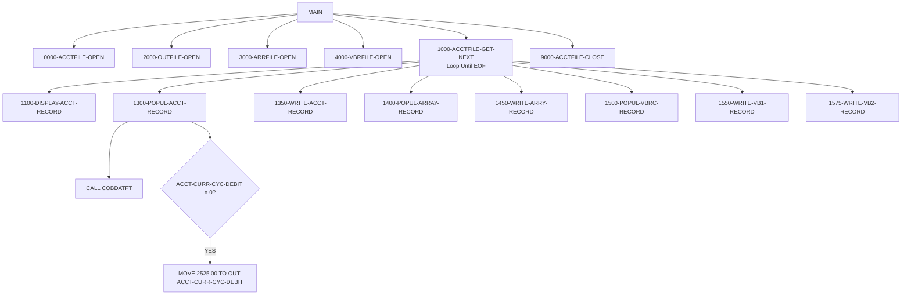

# Business Rules: CBACT01C

**Source program:** [app/cbl/CBACT01C.cbl](app/cbl/CBACT01C.cbl)  
**Program type:** BATCH  
**Complexity:** MEDIUM  
**Rules extracted:** 7  
**Extracted at:** 2026-03-06T00:00:00Z  

---

## Program Function

Account File Processor - Reads indexed ACCTFILE sequentially and writes transformed account data to multiple output files (sequential fixed, array, and variable-length) for downstream reporting and analysis.

## Rules Summary

| Rule ID | Name | Type | Confidence | Paragraph |
|---------|------|------|------------|-----------|
| CBACT01C.EOF-DETECTION | End of File Detection for Account File | CONDITIONAL | HIGH | 1000-ACCTFILE-GET-NEXT |
| CBACT01C.ACCTFILE-READ | Read Account File Sequentially | DATA-ACCESS | HIGH | 1000-ACCTFILE-GET-NEXT |
| CBACT01C.OUTFILE-WRITE | Write Processed Account Record to Output File | DATA-ACCESS | HIGH | 1350-WRITE-ACCT-RECORD |
| CBACT01C.DATE-FORMATTING | Format Account Dates Using COBDATFT | CALCULATION | HIGH | 1300-POPUL-ACCT-RECORD |
| CBACT01C.FILE-STATUS-CHECK | Validate File I/O Status Codes | VALIDATION | HIGH | 9910-DISPLAY-IO-STATUS |
| CBACT01C.ARRAY-POPULATION | Populate Account Balance Array | CALCULATION | HIGH | 1400-POPUL-ARRAY-RECORD |
| CBACT01C.DEFAULT-DEBIT-VALUE | Apply Default Debit Value When Zero | THRESHOLD | MEDIUM | 1300-POPUL-ACCT-RECORD |

---

## Rule Details

### CBACT01C.EOF-DETECTION — End of File Detection for Account File
**Type:** CONDITIONAL | **Confidence:** HIGH  
**Implemented in paragraph:** [1000-ACCTFILE-GET-NEXT](app/cbl/CBACT01C.cbl#L172-L200)  
**Governs fields:** `APPL-RESULT`, `APPL-EOF`, `END-OF-FILE`

**Description:** Detects end-of-file condition when sequential read of ACCTFILE returns no more records, signaled by file status 10 or APPL-EOF condition.

**COBOL snippet:**
```cobol
88 APPL-EOF VALUE 16
READ ACCTFILE-FILE NEXT RECORD
  AT END SET APPL-EOF TO TRUE
END-READ
```

**Business context:** Critical for batch processing termination; ensures all account records are processed exactly once without infinite loops or premature exit.

---

### CBACT01C.ACCTFILE-READ — Read Account File Sequentially
**Type:** DATA-ACCESS | **Confidence:** HIGH  
**Implemented in paragraph:** [1000-ACCTFILE-GET-NEXT](app/cbl/CBACT01C.cbl#L172-L200)  
**Governs fields:** `ACCTFILE-FILE`, `FD-ACCTFILE-REC`, `ACCTFILE-STATUS`

**Description:** Reads indexed ACCTFILE in sequential mode to process all account records for batch reporting.

**COBOL snippet:**
```cobol
READ ACCTFILE-FILE NEXT RECORD AT END SET APPL-EOF TO TRUE
```

**Business context:** Primary data access rule for batch account processing; supports read-only reporting without locking records.

---

### CBACT01C.OUTFILE-WRITE — Write Processed Account Record to Output File
**Type:** DATA-ACCESS | **Confidence:** HIGH  
**Implemented in paragraph:** [1350-WRITE-ACCT-RECORD](app/cbl/CBACT01C.cbl#L248-L256)  
**Governs fields:** `OUT-ACCT-REC`, `OUTFILE-STATUS`

**Description:** Writes transformed account data to sequential output file after date formatting and field population.

**COBOL snippet:**
```cobol
WRITE OUT-ACCT-REC
IF OUTFILE-STATUS NOT = '00' AND OUTFILE-STATUS NOT = '10'
   PERFORM 9999-ABEND-PROGRAM
END-IF
```

**Business context:** Ensures transformed account data is persisted for downstream consumption; enforces strict error handling (fail-fast on write errors).

---

### CBACT01C.DATE-FORMATTING — Format Account Dates Using COBDATFT
**Type:** CALCULATION | **Confidence:** HIGH  
**Implemented in paragraph:** [1300-POPUL-ACCT-RECORD](app/cbl/CBACT01C.cbl#L217-L246)  
**Governs fields:** `CODATECN-REC`, `OUT-ACCT-OPEN-DATE`, `OUT-ACCT-EXPIRAION-DATE`, `OUT-ACCT-REISSUE-DATE`

**Description:** Calls external date formatting utility COBDATFT to standardize account open date, expiration date, and reissue date into consistent format.

**COBOL snippet:**
```cobol
CALL 'COBDATFT' USING CODATECN-REC
MOVE CODATECN-0UT-DATE TO OUT-ACCT-OPEN-DATE
```

**Business context:** Centralizes date formatting logic in reusable utility; ensures consistent date formats across all output files.

---

### CBACT01C.FILE-STATUS-CHECK — Validate File I/O Status Codes
**Type:** VALIDATION | **Confidence:** HIGH  
**Implemented in paragraph:** [9910-DISPLAY-IO-STATUS](app/cbl/CBACT01C.cbl#L404-L417)  
**Governs fields:** `OUTFILE-STATUS`, `ARRYFILE-STATUS`, `VBRCFILE-STATUS`, `ACCTFILE-STATUS`

**Description:** Checks file status codes after every read/write operation; abends the program if status is not 00 or 10, ensuring data integrity.

**COBOL snippet:**
```cobol
IF OUTFILE-STATUS NOT = '00' AND OUTFILE-STATUS NOT = '10'
   DISPLAY 'ACCOUNT FILE WRITE STATUS IS:' OUTFILE-STATUS
   PERFORM 9999-ABEND-PROGRAM
END-IF
```

**Business context:** **CRITICAL CONTROL** - Prevents silent data loss or corruption. Aligns with SOX 404 controls for data integrity. Production deployments must log all file status violations.

**Regulatory reference:** SOX Section 404 (Internal Controls over Financial Reporting)

---

### CBACT01C.ARRAY-POPULATION — Populate Account Balance Array
**Type:** CALCULATION | **Confidence:** HIGH  
**Implemented in paragraph:** [1400-POPUL-ARRAY-RECORD](app/cbl/CBACT01C.cbl#L258-L267)  
**Governs fields:** `ARR-ACCT-BAL`, `ARR-ACCT-CURR-BAL`, `ARR-ACCT-CURR-CYC-DEBIT`

**Description:** Creates array structure containing account balance history with 5 occurrences of balance and debit cycle data using COMP-3 packed decimal format.

**COBOL snippet:**
```cobol
ARR-ACCT-BAL OCCURS 5 TIMES
10 ARR-ACCT-CURR-BAL    PIC S9(10)V99
10 ARR-ACCT-CURR-CYC-DEBIT PIC S9(10)V99 USAGE COMP-3
```

**Business context:** Generates array file for downstream analytic systems; preserves COMP-3 packed decimal representation for storage efficiency.

---

### CBACT01C.DEFAULT-DEBIT-VALUE — Apply Default Debit Value When Zero
**Type:** THRESHOLD | **Confidence:** MEDIUM  
**Implemented in paragraph:** [1300-POPUL-ACCT-RECORD](app/cbl/CBACT01C.cbl#L217-L246)  
**Governs fields:** `ACCT-CURR-CYC-DEBIT`, `OUT-ACCT-CURR-CYC-DEBIT`

**Description:** Sets current cycle debit amount to default value of 2525.00 when account has zero debit balance, likely for demonstration or testing purposes.

**COBOL snippet:**
```cobol
IF ACCT-CURR-CYC-DEBIT EQUAL TO ZERO
   MOVE 2525.00 TO OUT-ACCT-CURR-CYC-DEBIT
END-IF
```

**Business context:** **REVIEW REQUIRED** - This appears to be test/demo data injection. Verify if this logic should exist in production. May violate financial reporting accuracy requirements.

---

## Execution Flow



---

## Regulatory Compliance Mapping

| Regulation | Applicable Rules | Compliance Notes |
|------------|------------------|------------------|
| **SOX Section 404** | CBACT01C.FILE-STATUS-CHECK | Ensures data integrity through fail-fast error handling |

---

## Migration Notes

### Key Risk Factors
- **COMP-3 Packed Decimal:** `OUT-ACCT-CURR-CYC-DEBIT` uses COMP-3; must use `BigDecimal` in Java (NOT `double`)
- **Variable-Length Records:** VBRC-FILE has varying record sizes (10-80 bytes); requires special handling in modern I/O
- **REDEFINES Constructs:** TWO-BYTES-ALPHA redefines TWO-BYTES-BINARY; map to Java union types or separate fields

### Performance Characteristics
- Sequential scan of entire ACCTFILE (potentially millions of records)
- Synchronous writes to 3 output files (blocking I/O)
- External call to COBDATFT for each record (overhead)

### Test Coverage Requirements
- **Unit Tests:** EOF boundary condition, file status validation (00/10), default debit injection
- **Integration Tests:** End-to-end run with 10,000 account records
- **Edge Cases:** Empty input file, single-record file, I/O error simulation

---

## Related Programs

- **Called by:** None (batch entry point via JCL)
- **Calls:** COBDATFT (date formatter), CEE3ABD (abend handler)
- **Uses copybooks:** CVACT01Y (account record structure), CODATECN (date conversion structure)

---

**Generated from Neo4j Knowledge Graph**  
**Query used:**
```cypher
MATCH (p:Program {program_id: 'CBACT01C'})-[:EMBEDS]->(br:BusinessRule)
OPTIONAL MATCH (para:Paragraph)-[:IMPLEMENTS]->(br)
RETURN br.rule_id, br.name, br.rule_type, br.confidence, para.name AS paragraph
ORDER BY br.rule_id
```
