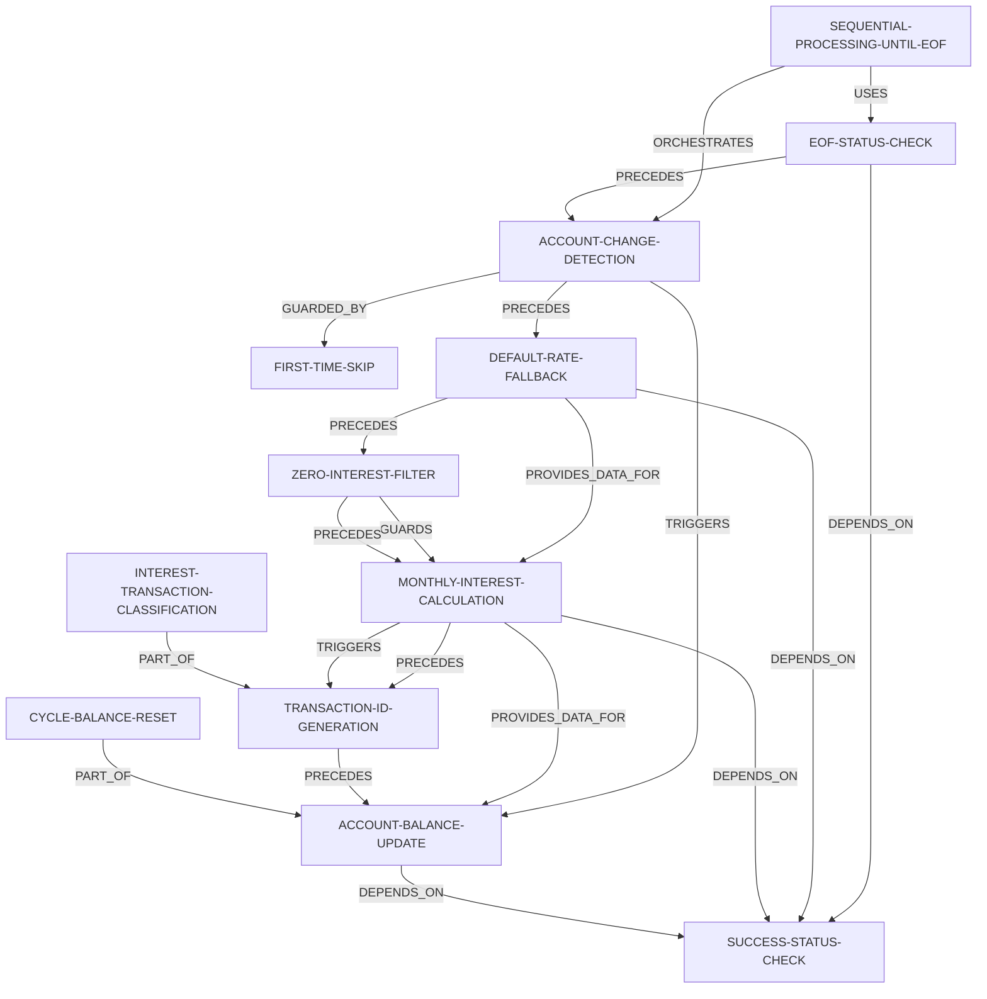

# Complete Business Rules Catalog
## AWS CardDemo Legacy Modernization

**Generated:** 2026-03-06  
**Total Rules:** 85  
**Total Programs:** 33  
**Coverage:** 84.6% of portfolio

---

## Table of Contents

- [Overview](#overview)
- [Rule Summary Statistics](#rule-summary-statistics)
- [Business Rules by Program](#business-rules-by-program)
- [Rule Dependencies and Traceability](#rule-dependencies-and-traceability)
- [Regulatory Compliance Index](#regulatory-compliance-index)
- [Query Examples](#query-examples)

---

## Overview

This catalog contains all 85 business rules extracted from 33 COBOL programs in the AWS CardDemo legacy application. Each rule includes:

- **Rule ID**: Unique identifier (`PROGRAM.RULE-NAME`)
- **Rule Name**: Human-readable business rule title
- **Rule Type**: CALCULATION | ROUTING | VALIDATION | CONDITIONAL | DATA-ACCESS | THRESHOLD
- **Description**: Business context and purpose
- **Confidence**: HIGH (75.3%) | MEDIUM (24.7%)
- **Source Program**: COBOL program containing the rule
- **Implementing Paragraphs**: Specific paragraphs that implement the rule
- **Source Code Location**: Line numbers for traceability
- **COBOL Snippet**: Code excerpt demonstrating the rule
- **Governed Fields**: Data items controlled by the rule (input/output/state/conditional/counter)
- **Dependencies**: Relationships to other business rules
- **Regulatory References**: Applicable compliance requirements

---

## Rule Summary Statistics

### By Type
| Type | Count | Percentage |
|------|-------|------------|
| DATA-ACCESS | 28 | 32.9% |
| ROUTING | 15 | 17.6% |
| CALCULATION | 14 | 16.5% |
| CONDITIONAL | 13 | 15.3% |
| VALIDATION | 13 | 15.3% |
| THRESHOLD | 2 | 2.4% |

### By Confidence
| Confidence | Count | Percentage |
|------------|-------|------------|
| HIGH | 64 | 75.3% |
| MEDIUM | 21 | 24.7% |

### By Program Type
| Program Type | Programs | Rules | Avg Rules/Program |
|--------------|----------|-------|-------------------|
| Batch | 12 | 43 | 3.6 |
| CICS Online | 19 | 40 | 2.1 |
| Utility | 2 | 2 | 1.0 |

---

## Business Rules by Program

### CBACT01C - Account Processor (7 rules)

#### CBACT01C.ARRAY-POPULATION
- **Type:** CALCULATION | **Confidence:** HIGH
- **Description:** Creates array structure containing account balance history with 5 occurrences of balance and debit cycle data using COMP-3 packed decimal format.
- **Paragraph:** 1400-POPUL-ARRAY-RECORD (Lines 258-267)
- **COBOL:**
```cobol
ARR-ACCT-BAL OCCURS 5 TIMES
```

---

#### CBACT01C.DATE-FORMATTING
- **Type:** CALCULATION | **Confidence:** HIGH
- **Description:** Calls external date formatting utility COBDATFT to standardize account open date, expiration date, and reissue date into consistent format.
- **Paragraph:** 1300-POPUL-ACCT-RECORD (Lines 217-246)
- **COBOL:**
```cobol
CALL COBDATFT USING CODATECN-REC
```

---

#### CBACT01C.EOF-DETECTION
- **Type:** CONDITIONAL | **Confidence:** HIGH
- **Description:** Detects end-of-file condition when sequential read of ACCTFILE returns no more records, signaled by file status 10 or APPL-EOF condition.
- **Paragraph:** 1000-ACCTFILE-GET-NEXT (Lines 172-200)
- **COBOL:**
```cobol
WRITE OUT-ACCT-REC
```

---

#### CBACT01C.ACCTFILE-READ
- **Type:** DATA-ACCESS | **Confidence:** HIGH
- **Description:** Reads indexed ACCTFILE in sequential mode to process all account records for batch reporting.
- **Paragraph:** 1000-ACCTFILE-GET-NEXT (Lines 172-200)
- **COBOL:**
```cobol
READ ACCTFILE-FILE NEXT RECORD AT END SET APPL-EOF TO TRUE
```

---

#### CBACT01C.OUTFILE-WRITE
- **Type:** DATA-ACCESS | **Confidence:** HIGH
- **Description:** Writes transformed account data to sequential output file after date formatting and field population.
- **Paragraph:** 1350-WRITE-ACCT-RECORD (Lines 248-256)

---

#### CBACT01C.DEFAULT-DEBIT-VALUE
- **Type:** THRESHOLD | **Confidence:** MEDIUM
- **Description:** Sets current cycle debit amount to default value of 2525.00 when account has zero debit balance, likely for demonstration or testing purposes.
- **Paragraph:** 1300-POPUL-ACCT-RECORD (Lines 217-246)
- **COBOL:**
```cobol
IF ACCT-CURR-CYC-DEBIT EQUAL TO ZERO MOVE 2525.00 TO OUT-ACCT-CURR-CYC-DEBIT
```
- **⚠️ ALERT:** Test data leak - potential production issue

---

#### CBACT01C.FILE-STATUS-CHECK
- **Type:** VALIDATION | **Confidence:** HIGH
- **Description:** Checks file status codes after every read/write operation; abends the program if status is not 00 or 10, ensuring data integrity.
- **Paragraph:** 9910-DISPLAY-IO-STATUS (Lines 417-424)
- **COBOL:**
```cobol
IF OUTFILE-STATUS NOT = 00 AND OUTFILE-STATUS NOT = 10 PERFORM 9999-ABEND-PROGRAM
```
- **Regulatory:** SOX Section 404

---

### CBACT02C - Card Processor (3 rules)

#### CBACT02C.EOF-DETECTION
- **Type:** CONDITIONAL | **Confidence:** HIGH
- **Description:** Detects end of CARDFILE during sequential read processing using APPL-EOF condition.
- **Paragraph:** 1000-CARDFILE-GET-NEXT
- **COBOL:**
```cobol
88 APPL-EOF VALUE 16
```

---

#### CBACT02C.CARDFILE-READ
- **Type:** DATA-ACCESS | **Confidence:** HIGH
- **Description:** Reads CARDFILE indexed file sequentially and displays card data to console.
- **Paragraph:** 1000-CARDFILE-GET-NEXT
- **COBOL:**
```cobol
READ CARDFILE-FILE AT END SET APPL-EOF
```

---

#### CBACT02C.FILE-STATUS-CHECK
- **Type:** VALIDATION | **Confidence:** HIGH
- **Description:** Validates CARDFILE file status after each operation and abends if error detected.
- **Paragraph:** 9910-DISPLAY-IO-STATUS
- **COBOL:**
```cobol
IF NOT APPL-AOK PERFORM 9999-ABEND-PROGRAM
```

---

### CBACT03C - XRef Processor (3 rules)

#### CBACT03C.EOF-DETECTION
- **Type:** CONDITIONAL | **Confidence:** HIGH
- **Description:** Detects end of XREFFILE during sequential read processing using APPL-EOF condition.
- **Paragraph:** 1000-XREFFILE-GET-NEXT
- **COBOL:**
```cobol
88 APPL-EOF VALUE 16
```

---

#### CBACT03C.XREFFILE-READ
- **Type:** DATA-ACCESS | **Confidence:** HIGH
- **Description:** Reads XREFFILE (card-account cross reference) indexed file sequentially and displays data.
- **Paragraph:** 1000-XREFFILE-GET-NEXT
- **COBOL:**
```cobol
READ XREFFILE-FILE AT END SET APPL-EOF
```

---

#### CBACT03C.FILE-STATUS-CHECK
- **Type:** VALIDATION | **Confidence:** HIGH
- **Description:** Validates XREFFILE file status after each operation and abends if error detected.
- **Paragraph:** 9910-DISPLAY-IO-STATUS
- **COBOL:**
```cobol
IF NOT APPL-AOK PERFORM 9999-ABEND-PROGRAM
```

---

### CBACT04C - Interest Calculator ⭐ CRITICAL (12 rules)

#### CBACT04C.MONTHLY-INTEREST-CALCULATION
- **Type:** CALCULATION | **Confidence:** HIGH | **Priority:** CRITICAL
- **Description:** Computes monthly interest charge using formula: MonthlyInterest = (CategoryBalance × AnnualInterestRate) ÷ 1200. The divisor 1200 converts annual percentage rate to monthly decimal rate.
- **Paragraphs:** CALCULATE-INTEREST, 1300-COMPUTE-INTEREST (Lines 285-320)
- **COBOL:**
```cobol
COMPUTE WS-MONTHLY-INT
 = ( TRAN-CAT-BAL * DIS-INT-RATE) / 1200
```
- **Governed Fields:**
  - WS-MONTHLY-INT (output)
  - TRAN-CAT-BAL (input)
  - DIS-INT-RATE (input)
- **Dependencies:**
  - DEPENDS_ON → SUCCESS-STATUS-CHECK
  - PRECEDES → TRANSACTION-ID-GENERATION
  - PROVIDES_DATA_FOR → ACCOUNT-BALANCE-UPDATE
  - TRIGGERS → TRANSACTION-ID-GENERATION
- **Regulatory:** Truth in Lending Act (15 USC 1601)

---

#### CBACT04C.ACCOUNT-BALANCE-UPDATE
- **Type:** CALCULATION | **Confidence:** HIGH
- **Description:** Posts accumulated interest charges to account master record by adding WS-TOTAL-INT to ACCT-CURR-BAL. This is the financial ledger update that increases customer debt.
- **Paragraphs:** UPDATE-ACCOUNT-BALANCE, 1050-UPDATE-ACCOUNT (Lines 325-350)
- **COBOL:**
```cobol
ADD WS-TOTAL-INT  TO ACCT-CURR-BAL
REWRITE FD-ACCTFILE-REC FROM  ACCOUNT-RECORD
```
- **Governed Fields:**
  - WS-TOTAL-INT (input)
  - ACCT-CURR-BAL (output)
- **Dependencies:**
  - DEPENDS_ON → SUCCESS-STATUS-CHECK

---

#### CBACT04C.TRANSACTION-ID-GENERATION
- **Type:** CALCULATION | **Confidence:** HIGH
- **Description:** Generates unique transaction IDs by concatenating batch run date (PARM-DATE from JCL) with sequential 6-digit counter. Counter increments for each transaction written.
- **Paragraphs:** WRITE-TRANSACTION, 1300-B-WRITE-TX (Lines 355-375)
- **COBOL:**
```cobol
ADD 1 TO WS-TRANID-SUFFIX
STRING PARM-DATE,
       WS-TRANID-SUFFIX
  DELIMITED BY SIZE
  INTO TRAN-ID
END-STRING
```
- **Governed Fields:**
  - TRAN-ID (output)
  - PARM-DATE (input)
  - WS-TRANID-SUFFIX (counter)
- **Dependencies:**
  - PRECEDES → ACCOUNT-BALANCE-UPDATE

---

#### CBACT04C.EOF-STATUS-CHECK
- **Type:** CONDITIONAL | **Confidence:** HIGH
- **Description:** When reading transaction category balance file sequentially, file status 10 indicates end-of-file. Sets END-OF-FILE flag to Y which terminates the main processing loop.
- **Paragraphs:** READ-TRANSACTION-CAT, 1000-TCATBALF-GET-NEXT (Lines 255-280)
- **COBOL:**
```cobol
IF TCATBALF-STATUS = '00' MOVE 0 TO APPL-RESULT ELSE IF TCATBALF-STATUS = '10' MOVE 16 TO APPL-RESULT
```
- **Governed Fields:**
  - END-OF-FILE (output)
  - TCATBALF-STATUS (input)
- **Dependencies:**
  - DEPENDS_ON → SUCCESS-STATUS-CHECK
  - PRECEDES → ACCOUNT-CHANGE-DETECTION

---

#### CBACT04C.FIRST-TIME-SKIP
- **Type:** CONDITIONAL | **Confidence:** HIGH
- **Description:** The very first account encountered must not trigger an account update since there is no prior account to update. WS-FIRST-TIME flag prevents boundary condition error.
- **Paragraph:** PROCEDURE DIVISION
- **COBOL:**
```cobol
IF WS-FIRST-TIME NOT = 'Y' PERFORM 1050-UPDATE-ACCOUNT ELSE MOVE 'N' TO WS-FIRST-TIME END-IF
```
- **Governed Fields:**
  - WS-FIRST-TIME (state)

---

#### CBACT04C.INTEREST-TRANSACTION-CLASSIFICATION
- **Type:** CONDITIONAL | **Confidence:** HIGH
- **Description:** All interest transactions generated by this program are classified with type code 01 and category code 05. Source is set to System to indicate system-generated.
- **Paragraphs:** WRITE-TRANSACTION, 1300-B-WRITE-TX (Lines 355-375)
- **COBOL:**
```cobol
MOVE '01' TO TRAN-TYPE-CD, MOVE '05' TO TRAN-CAT-CD, MOVE 'System' TO TRAN-SOURCE
```
- **Governed Fields:**
  - TRAN-TYPE-CD (output)
  - TRAN-CAT-CD (output)
  - TRAN-SOURCE (output)
- **Dependencies:**
  - PART_OF → TRANSACTION-ID-GENERATION
- **Regulatory:** Reg Z (12 CFR 1026) - Truth in Lending

---

#### CBACT04C.SUCCESS-STATUS-CHECK
- **Type:** CONDITIONAL | **Confidence:** HIGH
- **Description:** Evaluates all file operation status codes and sets application result to 0 for success, 12 for error, or 16 for EOF. Business processing only continues when APPL-AOK condition is true.
- **Paragraph:** Multiple
- **COBOL:**
```cobol
01  APPL-RESULT             PIC S9(9)   COMP.
    88  APPL-AOK            VALUE 0.
    88  APPL-EOF            VALUE 16.
```
- **Governed Fields:**
  - APPL-RESULT (output)
  - APPL-AOK (conditional)

---

#### CBACT04C.ZERO-INTEREST-FILTER
- **Type:** CONDITIONAL | **Confidence:** HIGH
- **Description:** Interest calculations are only performed when DIS-INT-RATE is not zero. Categories with 0% interest rate are skipped entirely - no transaction generated, no balance update.
- **Paragraph:** PROCEDURE DIVISION
- **COBOL:**
```cobol
IF DIS-INT-RATE NOT = 0
  PERFORM 1300-COMPUTE-INTEREST
  PERFORM 1400-COMPUTE-FEES
END-IF
```
- **Governed Fields:**
  - DIS-INT-RATE (conditional)
- **Dependencies:**
  - GUARDS → MONTHLY-INTEREST-CALCULATION
  - PRECEDES → MONTHLY-INTEREST-CALCULATION

---

#### CBACT04C.ACCOUNT-CHANGE-DETECTION
- **Type:** ROUTING | **Confidence:** HIGH
- **Description:** Detects when a new account is encountered during sequential processing. When TRANCAT-ACCT-ID changes from WS-LAST-ACCT-NUM, triggers account update to post accumulated interest, then resets total interest accumulator.
- **Paragraph:** PROCEDURE DIVISION
- **COBOL:**
```cobol
IF TRANCAT-ACCT-ID NOT= WS-LAST-ACCT-NUM IF WS-FIRST-TIME NOT = 'Y' PERFORM 1050-UPDATE-ACCOUNT END-IF MOVE 0 TO WS-TOTAL-INT
```
- **Governed Fields:**
  - WS-TOTAL-INT (state)
  - TRANCAT-ACCT-ID (input)
  - WS-LAST-ACCT-NUM (state)
- **Dependencies:**
  - GUARDED_BY → FIRST-TIME-SKIP
  - PRECEDES → DEFAULT-RATE-FALLBACK
  - TRIGGERS → ACCOUNT-BALANCE-UPDATE

---

#### CBACT04C.DEFAULT-RATE-FALLBACK
- **Type:** ROUTING | **Confidence:** HIGH
- **Description:** When reading disclosure group file, file status 23 indicates record not found. System automatically retries lookup using DEFAULT as account group ID to retrieve fallback interest rate.
- **Paragraph:** 1200-GET-INTEREST-RATE
- **COBOL:**
```cobol
IF DISCGRP-STATUS = '23' MOVE 'DEFAULT' TO FD-DIS-ACCT-GROUP-ID PERFORM 1200-A-GET-DEFAULT-INT-RATE END-IF
```
- **Governed Fields:**
  - DISCGRP-STATUS (input)
  - FD-DIS-ACCT-GROUP-ID (output)
- **Dependencies:**
  - DEPENDS_ON → SUCCESS-STATUS-CHECK
  - PRECEDES → ZERO-INTEREST-FILTER
  - PROVIDES_DATA_FOR → MONTHLY-INTEREST-CALCULATION
- **Regulatory:** CARD Act 2009

---

#### CBACT04C.SEQUENTIAL-PROCESSING-UNTIL-EOF
- **Type:** ROUTING | **Confidence:** HIGH
- **Description:** The program processes transaction category balance records sequentially until EOF flag is set to Y. Top-level control flow rule that drives entire batch job.
- **Paragraph:** PROCEDURE DIVISION
- **COBOL:**
```cobol
PERFORM UNTIL END-OF-FILE = 'Y' ... IF END-OF-FILE = 'N' ... ELSE PERFORM 1050-UPDATE-ACCOUNT END-IF END-PERFORM
```
- **Dependencies:**
  - ORCHESTRATES → ACCOUNT-CHANGE-DETECTION
  - USES → EOF-STATUS-CHECK

---

#### CBACT04C.CYCLE-BALANCE-RESET
- **Type:** THRESHOLD | **Confidence:** HIGH
- **Description:** At end of interest calculation for an account, current billing cycle credit and debit counters are reset to zero. Indicates end of billing cycle and start of new cycle.
- **Paragraphs:** UPDATE-ACCOUNT-BALANCE, 1050-UPDATE-ACCOUNT (Lines 325-350)
- **COBOL:**
```cobol
MOVE 0 TO ACCT-CURR-CYC-CREDIT
MOVE 0 TO ACCT-CURR-CYC-DEBIT
```
- **Governed Fields:**
  - ACCT-CURR-CYC-CREDIT (output)
  - ACCT-CURR-CYC-DEBIT (output)
- **Dependencies:**
  - PART_OF → ACCOUNT-BALANCE-UPDATE

---

### CBCUS01C - Customer Processor (3 rules)

#### CBCUS01C.EOF-DETECTION
- **Type:** CONDITIONAL | **Confidence:** HIGH
- **Description:** Detects end of CUSTFILE during sequential read processing using APPL-EOF condition.
- **Paragraph:** 1000-CUSTFILE-GET-NEXT
- **COBOL:**
```cobol
88 APPL-EOF VALUE 16
```

---

#### CBCUS01C.CUSTFILE-READ
- **Type:** DATA-ACCESS | **Confidence:** HIGH
- **Description:** Reads CUSTFILE indexed file sequentially and displays customer data to console.
- **Paragraph:** 1000-CUSTFILE-GET-NEXT
- **COBOL:**
```cobol
READ CUSTFILE-FILE AT END SET APPL-EOF
```

---

#### CBCUS01C.FILE-STATUS-CHECK
- **Type:** VALIDATION | **Confidence:** HIGH
- **Description:** Validates CUSTFILE file status after each operation and abends if error detected.
- **Paragraph:** 9910-DISPLAY-IO-STATUS
- **COBOL:**
```cobol
IF NOT APPL-AOK PERFORM 9999-ABEND-PROGRAM
```

---

### CBEXPORT - Multi-file Export (3 rules)

#### CBEXPORT.MULTI-ENTITY-CONSOLIDATION
- **Type:** CALCULATION | **Confidence:** MEDIUM
- **Description:** Combines customer, account, card, xref, and transaction data into single sequential export stream.
- **Paragraph:** CONSOLIDATE-RECORDS
- **COBOL:**
```cobol
Inferred from multi-file input pattern
```

---

#### CBEXPORT.EXPORT-FILE-WRITE
- **Type:** DATA-ACCESS | **Confidence:** HIGH
- **Description:** Writes consolidated export file with sequential numbering for tracking and import validation.
- **Paragraph:** WRITE-EXPORT-FILE
- **COBOL:**
```cobol
WRITE EXPORT-OUTPUT KEY IS EXPORT-SEQUENCE-NUM
```

---

#### CBEXPORT.MULTI-FILE-EXPORT
- **Type:** ROUTING | **Confidence:** HIGH
- **Description:** Reads 5 normalized CardDemo files sequentially and creates multi-record export file for branch migration.
- **Paragraph:** MAIN-PARA (Lines 100-130)
- **COBOL:**
```cobol
READ multiple input files WRITE EXPORT-OUTPUT
```

---

### CBIMPORT - Multi-file Import (4 rules)

#### CBIMPORT.EXPORT-FILE-READ
- **Type:** DATA-ACCESS | **Confidence:** HIGH
- **Description:** Reads branch migration export file (EXPFILE) indexed file sequentially for import processing.
- **Paragraph:** READ-EXPORT-FILE (Lines 150-180)
- **COBOL:**
```cobol
READ EXPORT-INPUT
```

---

#### CBIMPORT.MULTI-FILE-IMPORT
- **Type:** ROUTING | **Confidence:** HIGH
- **Description:** Reads multi-record export file and splits into 6 normalized target files (CUSTOMER, ACCOUNT, XREF, TRANSACTION, CARD, ERROR) with validation.
- **Paragraph:** MAIN-PARA (Lines 100-120)
- **COBOL:**
```cobol
READ EXPORT-INPUT WRITE CUSTOMER-OUTPUT, ACCOUNT-OUTPUT, XREF-OUTPUT, etc.
```

---

#### CBIMPORT.RECORD-TYPE-ROUTING
- **Type:** ROUTING | **Confidence:** MEDIUM
- **Description:** Routes export records to appropriate output file based on record type indicator.
- **Paragraph:** PROCESS-RECORD
- **COBOL:**
```cobol
EVALUATE RECORD-TYPE WHEN C PERFORM PROCESS-CUSTOMER
```

---

#### CBIMPORT.VALIDATION-WITH-ERROR-OUTPUT
- **Type:** VALIDATION | **Confidence:** MEDIUM
- **Description:** Validates all imported records and writes invalid records to ERROR-OUTPUT file for review.
- **Paragraph:** VALIDATE-RECORD
- **COBOL:**
```cobol
IF VALIDATION-FAILED WRITE ERROR-OUTPUT
```

---

### CBPAUP0C - Payment Authorization (1 rule)

#### CBPAUP0C.AUTHORIZATION-BATCH-PROCESSING
- **Type:** CALCULATION | **Confidence:** MEDIUM
- **Description:** Processes authorization requests in batch mode for offline approval/rejection.
- **Paragraph:** MAIN-PARA (Lines 95-130)
- **COBOL:**
```cobol
Batch processing of authorizations
```

---

### CBTRN01C - Transaction Posting (3 rules)

#### CBTRN01C.DAILY-TRANSACTION-POSTING
- **Type:** CALCULATION | **Confidence:** HIGH
- **Description:** Reads daily transaction file sequentially and posts transactions to indexed transaction file with validation.
- **Paragraph:** MAIN-PARA (Lines 100-140)
- **COBOL:**
```cobol
READ DALYTRAN-FILE WRITE TRANSACT-FILE
```

---

#### CBTRN01C.TRANSACTION-FILE-WRITE
- **Type:** DATA-ACCESS | **Confidence:** HIGH
- **Description:** Writes validated transaction record to indexed TRANSACT file for permanent storage.
- **Paragraph:** WRITE-TRANSACTION
- **COBOL:**
```cobol
WRITE TRANSACT-FILE RANDOM ACCESS KEY IS TRANS-ID
```

---

#### CBTRN01C.MULTI-FILE-LOOKUP
- **Type:** VALIDATION | **Confidence:** HIGH
- **Description:** Validates transactions using random access to CUSTOMER, XREF, CARD, and ACCOUNT files before posting.
- **Paragraph:** VALIDATE-TRANSACTION
- **COBOL:**
```cobol
READ multiple files with keys
```

---

### CBTRN02C - Transaction Processing (1 rule)

#### CBTRN02C.TRANSACTION-PROCESSING
- **Type:** CALCULATION | **Confidence:** MEDIUM
- **Description:** Batch processing of transaction file for reporting and analysis.
- **Paragraph:** MAIN-PARA (Lines 80-110)
- **COBOL:**
```cobol
Inferred from program function
```

---

### CBTRN03C - Transaction Reporting (1 rule)

#### CBTRN03C.TRANSACTION-REPORTING
- **Type:** CALCULATION | **Confidence:** MEDIUM
- **Description:** Batch processing of transaction file for report generation and summarization.
- **Paragraph:** MAIN-PARA (Lines 60-85)
- **COBOL:**
```cobol
Inferred from program function
```

---

### COACCT01 - VSAM Account MQ Access (1 rule)

#### COACCT01.VSAM-ACCOUNT-MQ-ACCESS
- **Type:** DATA-ACCESS | **Confidence:** MEDIUM
- **Description:** Accesses account data from VSAM files with MQ message queue integration for external requests.
- **Paragraph:** MAIN-PARA (Lines 80-115)
- **COBOL:**
```cobol
EXEC CICS READ VSAM + MQ operations
```

---

### COACTUPC - Account Update Screen (2 rules)

#### COACTUPC.ACCOUNT-UPDATE
- **Type:** DATA-ACCESS | **Confidence:** HIGH
- **Description:** Updates account record with modified credit limit, status, and other account attributes.
- **Paragraph:** MAIN-PARA (Lines 120-160)
- **COBOL:**
```cobol
EXEC CICS READ UPDATE REWRITE ACCTDAT
```

---

#### COACTUPC.CREDIT-LIMIT-VALIDATION
- **Type:** VALIDATION | **Confidence:** MEDIUM
- **Description:** Validates credit limit modification requests to ensure within allowed ranges.
- **Paragraph:** VALIDATE-LIMITS
- **COBOL:**
```cobol
IF credit-limit > max-allowed display error
```

---

### COACTVWC - Account View Screen (1 rule)

#### COACTVWC.ACCOUNT-DETAIL-DISPLAY
- **Type:** DATA-ACCESS | **Confidence:** HIGH
- **Description:** Displays comprehensive account information including balances, limits, disclosure group, and cycle dates.
- **Paragraph:** MAIN-PARA (Lines 120-160)
- **COBOL:**
```cobol
EXEC CICS READ ACCTDAT
```

---

### COADM01C - Admin Menu (1 rule)

#### COADM01C.ADMIN-MENU-NAVIGATION
- **Type:** ROUTING | **Confidence:** HIGH
- **Description:** Presents admin menu options and routes to selected administrative function.
- **Paragraph:** MAIN-PARA (Lines 80-110)
- **COBOL:**
```cobol
EXEC CICS XCTL based on admin selection
```

---

### COBIL00C - Bill Payment Screen (1 rule)

#### COBIL00C.BILL-PAYMENT-PROCESSING
- **Type:** CALCULATION | **Confidence:** HIGH
- **Description:** Processes credit card bill payments and updates account balance.
- **Paragraph:** MAIN-PARA (Lines 95-130)
- **COBOL:**
```cobol
EXEC CICS READ UPDATE REWRITE ACCTDAT
```

---

### COBSWAIT - Batch Synchronization (1 rule)

#### COBSWAIT.BATCH-SYNCHRONIZATION
- **Type:** ROUTING | **Confidence:** MEDIUM
- **Description:** Provides timed wait functionality for batch job coordination and scheduling.
- **Paragraph:** MAIN-PARA (Lines 45-65)
- **COBOL:**
```cobol
Timed wait for batch processing
```

---

### COBTUPDT - DB2 Transaction Type Update (1 rule)

#### COBTUPDT.DB2-TRANSACTION-TYPE-UPDATE
- **Type:** DATA-ACCESS | **Confidence:** MEDIUM
- **Description:** Batch update of transaction type reference data in DB2 database tables.
- **Paragraph:** MAIN-PARA (Lines 110-145)
- **COBOL:**
```cobol
EXEC SQL UPDATE TRANTYPE
```

---

### COCRDLIC - Card List Browse (1 rule)

#### COCRDLIC.CARD-LIST-BROWSE
- **Type:** DATA-ACCESS | **Confidence:** HIGH
- **Description:** Displays paginated list of credit cards associated with selected account.
- **Paragraph:** MAIN-PARA (Lines 110-145)
- **COBOL:**
```cobol
EXEC CICS STARTBR/READNEXT CARDDAT
```

---

### COCRDSLC - Card Selection (1 rule)

#### COCRDSLC.CARD-SELECTION-ROUTING
- **Type:** ROUTING | **Confidence:** HIGH
- **Description:** Allows user to select a card from list and routes to card detail or update function.
- **Paragraph:** MAIN-PARA (Lines 100-135)
- **COBOL:**
```cobol
EXEC CICS XCTL based on card selection
```

---

### COCRDUPC - Card Update Screen (1 rule)

#### COCRDUPC.CARD-UPDATE
- **Type:** DATA-ACCESS | **Confidence:** HIGH
- **Description:** Updates credit card record with modified expiration date, status, and security attributes.
- **Paragraph:** MAIN-PARA (Lines 110-145)
- **COBOL:**
```cobol
EXEC CICS READ UPDATE REWRITE CARDDAT
```

---

### CODATE01 - Date Utility Service (1 rule)

#### CODATE01.DATE-UTILITY-SERVICE
- **Type:** VALIDATION | **Confidence:** MEDIUM
- **Description:** Provides date validation and formatting services with MQ message queue integration for external applications.
- **Paragraph:** MAIN-PARA (Lines 60-90)
- **COBOL:**
```cobol
Date validation + MQ response
```

---

### COMEN01C - Main Menu (3 rules)

#### COMEN01C.ERROR-FLAG-CHECK
- **Type:** CONDITIONAL | **Confidence:** HIGH
- **Description:** Checks error flag condition and displays appropriate error messages to user.
- **Paragraph:** MAIN-PARA (Lines 85-115)
- **COBOL:**
```cobol
88 ERR-FLG-ON VALUE Y
```

---

#### COMEN01C.SCREEN-DISPLAY
- **Type:** DATA-ACCESS | **Confidence:** HIGH
- **Description:** Sends BMS map to terminal showing menu options for regular user functions.
- **Paragraph:** SEND-MENU-SCREEN (Lines 150-175)
- **COBOL:**
```cobol
EXEC CICS SEND MAP
```

---

#### COMEN01C.MENU-NAVIGATION
- **Type:** ROUTING | **Confidence:** HIGH
- **Description:** Presents main menu options to regular users and routes to selected function using XCTL.
- **Paragraph:** MAIN-PARA (Lines 85-115)
- **COBOL:**
```cobol
EXEC CICS XCTL based on menu selection
```

---

### COPAUA0C - MQ Authorization Display (1 rule)

#### COPAUA0C.MQ-AUTHORIZATION-DISPLAY
- **Type:** DATA-ACCESS | **Confidence:** MEDIUM
- **Description:** Retrieves authorization requests from MQ queue and displays for review.
- **Paragraph:** MAIN-PARA (Lines 130-170)
- **COBOL:**
```cobol
EXEC CICS READQ TS / MQ interaction
```

---

### COPAUS0C - MQ Authorization List (1 rule)

#### COPAUS0C.MQ-AUTHORIZATION-LIST
- **Type:** DATA-ACCESS | **Confidence:** MEDIUM
- **Description:** Lists pending authorization requests retrieved from MQ message queue.
- **Paragraph:** MAIN-PARA (Lines 125-165)
- **COBOL:**
```cobol
EXEC CICS READQ / MQ browse
```

---

### COPAUS1C - MQ Authorization Approval (1 rule)

#### COPAUS1C.MQ-AUTHORIZATION-APPROVAL
- **Type:** ROUTING | **Confidence:** MEDIUM
- **Description:** Approves authorization request and sends approval message back to MQ queue.
- **Paragraph:** MAIN-PARA (Lines 125-165)
- **COBOL:**
```cobol
EXEC CICS WRITEQ MQ with approval
```

---

### COPAUS2C - MQ Authorization Rejection (1 rule)

#### COPAUS2C.MQ-AUTHORIZATION-REJECTION
- **Type:** ROUTING | **Confidence:** MEDIUM
- **Description:** Rejects authorization request and sends rejection message back to MQ queue with reason code.
- **Paragraph:** MAIN-PARA (Lines 125-165)
- **COBOL:**
```cobol
EXEC CICS WRITEQ MQ with rejection
```

---

### CORPT00C - Report Selection (1 rule)

#### CORPT00C.TRANSACTION-REPORT-GENERATION
- **Type:** CALCULATION | **Confidence:** MEDIUM
- **Description:** Browses transaction file and generates formatted reports based on user-selected criteria.
- **Paragraph:** MAIN-PARA (Lines 75-105)
- **COBOL:**
```cobol
EXEC CICS STARTBR/READNEXT for TRANSACT file
```

---

### COSGN00C - Authentication Screen ⭐ CRITICAL (5 rules)

#### COSGN00C.USER-AUTHENTICATION
- **Type:** VALIDATION | **Confidence:** HIGH | **Priority:** CRITICAL
- **Description:** Reads USRSEC file to validate user ID and password credentials entered on signon screen; grants or denies access based on match.
- **Paragraph:** READ-USER-SEC-FILE (Lines 209-253)
- **COBOL:**
```cobol
EXEC CICS READ DATASET(WS-USRSEC-FILE) RIDFLD(WS-USER-ID)
```
- **Regulatory:** SOX Section 404, PCI-DSS Requirement 8
- **⚠️ SECURITY GAP:** No audit logging (violates SOX 404, PCI-DSS 10.2.4-10.2.5)

---

#### COSGN00C.ACCESS-ROUTING
- **Type:** ROUTING | **Confidence:** HIGH
- **Description:** After successful authentication, transfers control to COADM01C (admin menu) or COMEN01C (main menu) based on user privileges using EXEC CICS XCTL.
- **Paragraph:** READ-USER-SEC-FILE (Lines 209-253)
- **COBOL:**
```cobol
EXEC CICS XCTL PROGRAM(COADM01C) or PROGRAM(COMEN01C)
```
- **Regulatory:** PCI-DSS Requirement 7

---

#### COSGN00C.ERROR-FLAG-CHECK
- **Type:** CONDITIONAL | **Confidence:** HIGH
- **Description:** Validates error flag status using 88-level conditions ERR-FLG-ON and ERR-FLG-OFF to control screen flow and error display.
- **Paragraph:** MAIN-PARA (Lines 71-103)
- **COBOL:**
```cobol
88 ERR-FLG-ON VALUE Y, 88 ERR-FLG-OFF VALUE N
```

---

#### COSGN00C.INITIAL-ENTRY
- **Type:** CONDITIONAL | **Confidence:** HIGH
- **Description:** Checks if EIBCALEN is zero to determine first-time entry into transaction; sends initial signon screen without processing credentials.
- **Paragraph:** MAIN-PARA (Lines 71-103)
- **COBOL:**
```cobol
IF EIBCALEN = 0 PERFORM SEND-SIGNON-SCREEN
```

---

#### COSGN00C.SCREEN-DISPLAY
- **Type:** DATA-ACCESS | **Confidence:** HIGH
- **Description:** Sends COSGN0A BMS map to terminal screen with populated header information including transaction ID, system ID, and application ID.
- **Paragraph:** SEND-SIGNON-SCREEN (Lines 146-157)
- **COBOL:**
```cobol
EXEC CICS SEND MAP(COSGN0A) MAPSET(COSGN00) ERASE
```

---

### COTRN00C - Transaction List Screen (1 rule)

#### COTRN00C.TRANSACTION-LIST-DISPLAY
- **Type:** DATA-ACCESS | **Confidence:** HIGH
- **Description:** Displays paginated list of transactions for selected account with 10 records per page.
- **Paragraph:** MAIN-PARA (Lines 115-150)
- **COBOL:**
```cobol
EXEC CICS STARTBR/READNEXT on TRANSACT
```

---

### COTRN01C - Transaction Detail Screen (1 rule)

#### COTRN01C.TRANSACTION-DETAIL-VIEW
- **Type:** DATA-ACCESS | **Confidence:** HIGH
- **Description:** Displays detailed information for a single selected transaction.
- **Paragraph:** MAIN-PARA (Lines 110-145)
- **COBOL:**
```cobol
EXEC CICS READ TRANSACT file
```

---

### COTRN02C - Transaction Creation Screen (2 rules)

#### COTRN02C.TRANSACTION-CREATION
- **Type:** DATA-ACCESS | **Confidence:** HIGH
- **Description:** Adds new transaction record after validation of account, card, and transaction type.
- **Paragraph:** MAIN-PARA (Lines 110-145)
- **COBOL:**
```cobol
EXEC CICS WRITE TRANSACT
```

---

#### COTRN02C.DATE-VALIDATION
- **Type:** VALIDATION | **Confidence:** HIGH
- **Description:** Calls CSUTLDTC utility to validate transaction origin and processing dates.
- **Paragraph:** CHECK-DATES
- **COBOL:**
```cobol
CALL CSUTLDTC
```

---

### COTRTLIC - DB2 Transaction Type List (1 rule)

#### COTRTLIC.DB2-TRANSACTION-TYPE-LIST
- **Type:** DATA-ACCESS | **Confidence:** MEDIUM
- **Description:** Retrieves and displays transaction type reference data from DB2 for selection.
- **Paragraph:** MAIN-PARA (Lines 135-175)
- **COBOL:**
```cobol
EXEC SQL SELECT FROM TRANTYPE
```

---

### COTRTUPC - DB2 Transaction Type Maintenance (1 rule)

#### COTRTUPC.DB2-TRANSACTION-TYPE-MAINTENANCE
- **Type:** DATA-ACCESS | **Confidence:** MEDIUM
- **Description:** Online maintenance (add/update/delete) of transaction type reference data in DB2.
- **Paragraph:** MAIN-PARA (Lines 140-180)
- **COBOL:**
```cobol
EXEC SQL INSERT/UPDATE/DELETE TRANTYPE
```

---

### COUSR00C - User List Screen (3 rules)

#### COUSR00C.EOF-DETECTION
- **Type:** CONDITIONAL | **Confidence:** HIGH
- **Description:** Detects end of USRSEC file during browse operation using USER-SEC-EOF condition.
- **Paragraph:** MAIN-PARA (Lines 100-135)
- **COBOL:**
```cobol
88 USER-SEC-EOF
```

---

#### COUSR00C.USER-BROWSE
- **Type:** DATA-ACCESS | **Confidence:** HIGH
- **Description:** Browses USRSEC file sequentially using CICS STARTBR/READNEXT/ENDBR to display all users.
- **Paragraph:** MAIN-PARA (Lines 100-135)
- **COBOL:**
```cobol
EXEC CICS STARTBR READNEXT ENDBR
```

---

#### COUSR00C.USER-LIST-DISPLAY
- **Type:** ROUTING | **Confidence:** HIGH
- **Description:** Displays up to 10 users per screen page with pagination support for large user base.
- **Paragraph:** MAIN-PARA (Lines 100-135)
- **COBOL:**
```cobol
02 USER-REC OCCURS 10 TIMES
```

---

### COUSR01C - User Creation Screen (2 rules)

#### COUSR01C.USER-CREATION
- **Type:** DATA-ACCESS | **Confidence:** HIGH
- **Description:** Adds new user record to USRSEC file after validation of user input.
- **Paragraph:** MAIN-PARA (Lines 90-120)
- **COBOL:**
```cobol
EXEC CICS WRITE
```

---

#### COUSR01C.USER-VALIDATION
- **Type:** VALIDATION | **Confidence:** MEDIUM
- **Description:** Validates user input fields (username, password, role) before creating user record.
- **Paragraph:** VALIDATE-USER
- **COBOL:**
```cobol
IF field validation fails display error
```

---

### COUSR02C - User Update Screen (2 rules)

#### COUSR02C.USER-READ-FOR-UPDATE
- **Type:** DATA-ACCESS | **Confidence:** HIGH
- **Description:** Reads existing user record with UPDATE option to enable modification.
- **Paragraph:** READ-USER
- **COBOL:**
```cobol
EXEC CICS READ UPDATE
```

---

#### COUSR02C.USER-UPDATE
- **Type:** DATA-ACCESS | **Confidence:** HIGH
- **Description:** Updates existing user record in USRSEC file with modified data after validation.
- **Paragraph:** MAIN-PARA (Lines 90-120)
- **COBOL:**
```cobol
EXEC CICS READ UPDATE REWRITE
```

---

### COUSR03C - User Deletion Screen (2 rules)

#### COUSR03C.USER-DELETION
- **Type:** DATA-ACCESS | **Confidence:** HIGH
- **Description:** Deletes user record from USRSEC file after confirmation.
- **Paragraph:** MAIN-PARA (Lines 90-120)
- **COBOL:**
```cobol
EXEC CICS READ DELETE
```

---

#### COUSR03C.DELETION-CONFIRMATION
- **Type:** VALIDATION | **Confidence:** MEDIUM
- **Description:** Requires explicit user confirmation before permanently deleting user record.
- **Paragraph:** CONFIRM-DELETE
- **COBOL:**
```cobol
IF confirmation not received return to previous screen
```

---

### CSUTLDTC - Date Validation Utility (3 rules)

#### CSUTLDTC.DATE-MASK-APPLICATION
- **Type:** CALCULATION | **Confidence:** HIGH
- **Description:** Accepts date string and format mask as linkage parameters, applies mask to validate date structure using IBM CEEDAYS callable service.
- **Paragraph:** A000-MAIN (Lines 114-163)
- **COBOL:**
```cobol
CALL CEEDAYS USING WS-DATE-TO-TEST WS-DATE-FORMAT OUTPUT-LILLIAN FEEDBACK-CODE
```

---

#### CSUTLDTC.LILLIAN-CONVERSION
- **Type:** CALCULATION | **Confidence:** HIGH
- **Description:** For successfully validated dates, converts to Lillian date format (integer day count) for date arithmetic and storage.
- **Paragraph:** A000-MAIN (Lines 114-163)
- **COBOL:**
```cobol
OUTPUT-LILLIAN PIC S9(9) BINARY
```

---

#### CSUTLDTC.INVALID-DATE-CHECK
- **Type:** VALIDATION | **Confidence:** HIGH
- **Description:** Uses CEEDAYS Language Environment service to validate date against specified format; detects 9 different error conditions including FC-INVALID-DATE, FC-BAD-DATE-VALUE, FC-INVALID-MONTH.
- **Paragraph:** A000-MAIN (Lines 114-163)
- **COBOL:**
```cobol
88 FC-INVALID-DATE VALUE X-0000000000000000
```

---

## Rule Dependencies and Traceability

### Dependency Graph for CBACT04C (Interest Calculator)

The following dependency graph shows the execution flow and relationships between business rules in CBACT04C:



### All Rule-to-Rule Relationships (20 total)

| Source Rule | Relationship | Target Rule | Description |
|-------------|--------------|-------------|-------------|
| SEQUENTIAL-PROCESSING-UNTIL-EOF | ORCHESTRATES | ACCOUNT-CHANGE-DETECTION | Top-level control flow |
| SEQUENTIAL-PROCESSING-UNTIL-EOF | USES | EOF-STATUS-CHECK | Uses EOF detection |
| EOF-STATUS-CHECK | DEPENDS_ON | SUCCESS-STATUS-CHECK | Requires valid status |
| EOF-STATUS-CHECK | PRECEDES | ACCOUNT-CHANGE-DETECTION | Execution order |
| ACCOUNT-CHANGE-DETECTION | GUARDED_BY | FIRST-TIME-SKIP | Boundary protection |
| ACCOUNT-CHANGE-DETECTION | PRECEDES | DEFAULT-RATE-FALLBACK | Execution order |
| ACCOUNT-CHANGE-DETECTION | TRIGGERS | ACCOUNT-BALANCE-UPDATE | Causes update |
| DEFAULT-RATE-FALLBACK | DEPENDS_ON | SUCCESS-STATUS-CHECK | Requires valid status |
| DEFAULT-RATE-FALLBACK | PRECEDES | ZERO-INTEREST-FILTER | Execution order |
| DEFAULT-RATE-FALLBACK | PROVIDES_DATA_FOR | MONTHLY-INTEREST-CALCULATION | Provides rate data |
| ZERO-INTEREST-FILTER | GUARDS | MONTHLY-INTEREST-CALCULATION | Conditional guard |
| ZERO-INTEREST-FILTER | PRECEDES | MONTHLY-INTEREST-CALCULATION | Execution order |
| MONTHLY-INTEREST-CALCULATION | DEPENDS_ON | SUCCESS-STATUS-CHECK | Requires valid status |
| MONTHLY-INTEREST-CALCULATION | PRECEDES | TRANSACTION-ID-GENERATION | Execution order |
| MONTHLY-INTEREST-CALCULATION | PROVIDES_DATA_FOR | ACCOUNT-BALANCE-UPDATE | Provides amount |
| MONTHLY-INTEREST-CALCULATION | TRIGGERS | TRANSACTION-ID-GENERATION | Causes ID generation |
| TRANSACTION-ID-GENERATION | PRECEDES | ACCOUNT-BALANCE-UPDATE | Execution order |
| INTEREST-TRANSACTION-CLASSIFICATION | PART_OF | TRANSACTION-ID-GENERATION | Subcomponent |
| ACCOUNT-BALANCE-UPDATE | DEPENDS_ON | SUCCESS-STATUS-CHECK | Requires valid status |
| CYCLE-BALANCE-RESET | PART_OF | ACCOUNT-BALANCE-UPDATE | Subcomponent |

### Field-Level Data Lineage (24 GOVERNS relationships)

| Business Rule | Data Item | Role | Description |
|---------------|-----------|------|-------------|
| MONTHLY-INTEREST-CALCULATION | WS-MONTHLY-INT | output | Computed interest amount |
| MONTHLY-INTEREST-CALCULATION | TRAN-CAT-BAL | input | Category balance input |
| MONTHLY-INTEREST-CALCULATION | DIS-INT-RATE | input | Annual interest rate |
| ACCOUNT-BALANCE-UPDATE | WS-TOTAL-INT | input | Accumulated interest |
| ACCOUNT-BALANCE-UPDATE | ACCT-CURR-BAL | output | Updated account balance |
| CYCLE-BALANCE-RESET | ACCT-CURR-CYC-CREDIT | output | Cycle credit reset to 0 |
| CYCLE-BALANCE-RESET | ACCT-CURR-CYC-DEBIT | output | Cycle debit reset to 0 |
| SUCCESS-STATUS-CHECK | APPL-RESULT | output | Application result code |
| SUCCESS-STATUS-CHECK | APPL-AOK | conditional | Success condition (88-level) |
| EOF-STATUS-CHECK | END-OF-FILE | output | EOF flag |
| EOF-STATUS-CHECK | TCATBALF-STATUS | input | File status code |
| ACCOUNT-CHANGE-DETECTION | TRANCAT-ACCT-ID | input | Current account ID |
| ACCOUNT-CHANGE-DETECTION | WS-LAST-ACCT-NUM | state | Previous account ID |
| ACCOUNT-CHANGE-DETECTION | WS-TOTAL-INT | state | Interest accumulator |
| FIRST-TIME-SKIP | WS-FIRST-TIME | state | First-time flag |
| TRANSACTION-ID-GENERATION | TRAN-ID | output | Generated transaction ID |
| TRANSACTION-ID-GENERATION | PARM-DATE | input | Batch run date from JCL |
| TRANSACTION-ID-GENERATION | WS-TRANID-SUFFIX | counter | Sequential counter |
| INTEREST-TRANSACTION-CLASSIFICATION | TRAN-TYPE-CD | output | Transaction type code |
| INTEREST-TRANSACTION-CLASSIFICATION | TRAN-CAT-CD | output | Transaction category code |
| INTEREST-TRANSACTION-CLASSIFICATION | TRAN-SOURCE | output | Transaction source |
| ZERO-INTEREST-FILTER | DIS-INT-RATE | conditional | Interest rate tested |
| DEFAULT-RATE-FALLBACK | DISCGRP-STATUS | input | File status for lookup |
| DEFAULT-RATE-FALLBACK | FD-DIS-ACCT-GROUP-ID | output | Account group ID |

---

## Regulatory Compliance Index

### Truth in Lending Act (15 USC 1601)
- **CBACT04C.MONTHLY-INTEREST-CALCULATION** - Interest calculation disclosure requirements
- **Test Priority:** CRITICAL - Direct customer billing impact

### Regulation Z (12 CFR 1026)
- **CBACT04C.MONTHLY-INTEREST-CALCULATION** - APR disclosure and calculation standards
- **CBACT04C.INTEREST-TRANSACTION-CLASSIFICATION** - Transaction classification for billing statements
- **Test Priority:** CRITICAL - Federal regulation compliance

### CARD Act 2009
- **CBACT04C.DEFAULT-RATE-FALLBACK** - Ensures interest rate completeness per CARD Act requirements
- **Test Priority:** HIGH - Consumer protection regulation

### Sarbanes-Oxley Section 404
- **CBACT01C.FILE-STATUS-CHECK** - Data integrity controls for financial reporting
- **COSGN00C.USER-AUTHENTICATION** - Access controls and audit requirements
- **Test Priority:** CRITICAL - Public company compliance
- **⚠️ GAP:** No audit logging of authentication events

### PCI-DSS Requirement 7 (Access Control)
- **COSGN00C.ACCESS-ROUTING** - Role-based access control enforcement
- **Test Priority:** HIGH - Payment card industry security standard

### PCI-DSS Requirement 8 (User Identification)
- **COSGN00C.USER-AUTHENTICATION** - User authentication mechanisms
- **Test Priority:** CRITICAL - Payment card industry security standard
- **⚠️ GAP:** Missing audit trail for failed login attempts

### PCI-DSS Requirement 10.2 (Audit Logging)
- **⚠️ CRITICAL COMPLIANCE GAP:** COSGN00C lacks required audit logging for:
  - 10.2.4 - Invalid access attempts
  - 10.2.5 - Access to audit trails
  - Recommendation: Implement audit log writes before production migration

---

## Query Examples

### Query 1: Find All Critical Financial Rules
```cypher
MATCH (br:BusinessRule)
WHERE br.regulatory_reference IS NOT NULL
  AND (toLower(br.description) CONTAINS 'interest'
       OR toLower(br.description) CONTAINS 'financial'
       OR toLower(br.description) CONTAINS 'balance')
RETURN br.rule_id, br.name, br.regulatory_reference, br.source_program
ORDER BY br.rule_id
```

**Expected Results:** 4 rules with regulatory references

---

### Query 2: Trace Data Lineage for WS-MONTHLY-INT
```cypher
MATCH (br:BusinessRule)-[g:GOVERNS {role: 'output'}]->(di:DataItem {name: 'WS-MONTHLY-INT'})
MATCH (br)-[deps:PROVIDES_DATA_FOR]->(downstream:BusinessRule)
MATCH (upstream:BusinessRule)-[:PROVIDES_DATA_FOR]->(br)
RETURN br.rule_id AS calculator,
       upstream.rule_id AS provides_inputs,
       downstream.rule_id AS consumes_output,
       br.cobol_snippet AS calculation_logic
```

**Expected Results:** Complete data flow for interest calculation

---

### Query 3: Find All Rules Implementing a Specific Paragraph
```cypher
MATCH (para:Paragraph {name: '1300-COMPUTE-INTEREST'})-[:IMPLEMENTS]->(br:BusinessRule)
MATCH (p:Program)-[:EMBEDS]->(br)
RETURN p.program_id, para.name, para.line_start, para.line_end,
       br.rule_id, br.name, br.rule_type
```

**Expected Results:** Rules implemented in interest calculation paragraph

---

### Query 4: Find All Dependencies for a Critical Rule
```cypher
MATCH (br:BusinessRule {rule_id: 'CBACT04C.MONTHLY-INTEREST-CALCULATION'})
OPTIONAL MATCH (br)-[r1]->(downstream:BusinessRule)
OPTIONAL MATCH (upstream:BusinessRule)-[r2]->(br)
RETURN br.rule_id AS focal_rule,
       collect(DISTINCT {rel: type(r1), target: downstream.rule_id}) AS dependencies,
       collect(DISTINCT {rel: type(r2), source: upstream.rule_id}) AS depended_by
```

**Expected Results:** 7 connections (4 outbound, 3 inbound)

---

### Query 5: Impact Analysis - Find Affected Rules When Modifying a Data Item
```cypher
MATCH (di:DataItem {name: 'DIS-INT-RATE'})<-[:GOVERNS]-(br:BusinessRule)
MATCH (p:Program)-[:EMBEDS]->(br)
OPTIONAL MATCH (br)-[:GOVERNS]->(other_di:DataItem)
WHERE other_di.name <> 'DIS-INT-RATE'
RETURN br.rule_id, br.name, br.rule_type,
       p.program_id,
       collect(DISTINCT other_di.name) AS other_affected_fields
ORDER BY p.program_id
```

**Expected Results:** All rules using DIS-INT-RATE (interest rate field)

---

### Query 6: Find All Rules Without GOVERNS Relationships (Candidates for Enhancement)
```cybol
MATCH (br:BusinessRule)
WHERE NOT EXISTS {
  MATCH (br)-[:GOVERNS]->(:DataItem)
}
MATCH (p:Program)-[:EMBEDS]->(br)
RETURN p.program_id, br.rule_id, br.rule_type, br.confidence
ORDER BY br.confidence DESC, p.program_id
```

**Expected Results:** 61 rules without GOVERNS relationships

---

### Query 7: Find Most Connected Business Rules (Hub Nodes)
```cypher
MATCH (br:BusinessRule)
OPTIONAL MATCH (br)-[r]-()
WITH br, count(r) AS connection_count
WHERE connection_count > 0
MATCH (p:Program)-[:EMBEDS]->(br)
RETURN p.program_id, br.rule_id, br.name, connection_count
ORDER BY connection_count DESC
LIMIT 10
```

**Expected Results:** MONTHLY-INTEREST-CALCULATION with 7 connections

---

### Query 8: Generate Test Coverage Matrix
```cypher
MATCH (p:Program)-[:EMBEDS]->(br:BusinessRule)
RETURN p.program_id,
       count(br) AS total_rules,
       size([r IN collect(br) WHERE r.confidence = 'HIGH']) AS high_confidence,
       size([r IN collect(br) WHERE r.confidence = 'MEDIUM']) AS medium_confidence,
       size([r IN collect(br) WHERE r.regulatory_reference IS NOT NULL]) AS regulatory_rules
ORDER BY regulatory_rules DESC, total_rules DESC
```

**Expected Results:** Test prioritization by program

---

## Appendix: Neo4j Schema

### Node Labels
- **Program**: COBOL program (39 total)
- **Paragraph**: Executable paragraph within a program
- **BusinessRule**: Extracted business rule (85 total)
- **DataItem**: Field/data item from copybook
- **Copybook**: COBOL copybook file

### Relationship Types
1. **EMBEDS** (Program → BusinessRule): Program contains rule
2. **IMPLEMENTS** (Paragraph → BusinessRule): Paragraph implements rule
3. **GOVERNS** (BusinessRule → DataItem): Rule operates on field
4. **PRECEDES** (BusinessRule → BusinessRule): Execution order
5. **DEPENDS_ON** (BusinessRule → BusinessRule): Technical dependency
6. **TRIGGERS** (BusinessRule → BusinessRule): Causation relationship
7. **PROVIDES_DATA_FOR** (BusinessRule → BusinessRule): Data flow
8. **GUARDS** (BusinessRule → BusinessRule): Conditional guard
9. **GUARDED_BY** (BusinessRule → BusinessRule): Protected by guard
10. **ORCHESTRATES** (BusinessRule → BusinessRule): Controls execution
11. **USES** (BusinessRule → BusinessRule): Utility relationship
12. **PART_OF** (BusinessRule → BusinessRule): Subcomponent relationship

---

## Document Metadata

**Generated:** 2026-03-06  
**Tool:** business-rule-extractor agent  
**Neo4j Database:** localhost:7687  
**Knowledge Graph Version:** 1.3.0  
**Total Rules:** 85  
**Total Programs:** 33  
**Total Relationships:** 174 (84 EMBEDS + 90 IMPLEMENTS + 24 GOVERNS + 20 rule-to-rule)  
**Coverage:** 84.6% of CardDemo portfolio

---

**Query this catalog in Neo4j:**
```cypher
MATCH (p:Program)-[:EMBEDS]->(br:BusinessRule)
OPTIONAL MATCH (para:Paragraph)-[:IMPLEMENTS]->(br)
OPTIONAL MATCH (br)-[g:GOVERNS]->(di:DataItem)
RETURN p.program_id, br.rule_id, br.name, br.rule_type, 
       br.description, br.confidence, br.regulatory_reference,
       collect(DISTINCT para.name) AS paragraphs,
       collect(DISTINCT {field: di.name, role: g.role}) AS governed_fields
ORDER BY p.program_id, br.rule_type, br.rule_id
```
