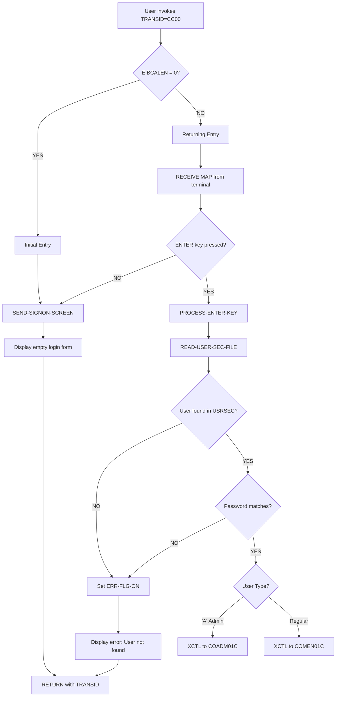

# Business Rules: COSGN00C

**Source program:** [app/cbl/COSGN00C.cbl](app/cbl/COSGN00C.cbl)  
**Program type:** CICS  
**Complexity:** LOW  
**Rules extracted:** 5  
**Extracted at:** 2026-03-06T00:00:00Z  

---

## Program Function

User Authentication & Authorization - CICS online signon screen that validates user credentials against USRSEC security file and routes authenticated users to appropriate menu screens (admin or general menu) based on access privileges.

## Rules Summary

| Rule ID | Name | Type | Confidence | Paragraph |
|---------|------|------|------------|-----------|
| COSGN00C.ERROR-FLAG-CHECK | Error Flag Status Validation | CONDITIONAL | HIGH | MAIN-PARA |
| COSGN00C.USER-AUTHENTICATION | User Credential Validation Against Security File | VALIDATION | HIGH | READ-USER-SEC-FILE |
| COSGN00C.ACCESS-ROUTING | Route User to Authorized Menu Based on Role | ROUTING | HIGH | READ-USER-SEC-FILE |
| COSGN00C.SCREEN-DISPLAY | Display Signon Screen with BMS Map | DATA-ACCESS | HIGH | SEND-SIGNON-SCREEN |
| COSGN00C.INITIAL-ENTRY | Detect Initial Transaction Entry | CONDITIONAL | HIGH | MAIN-PARA |

---

## Rule Details

### COSGN00C.ERROR-FLAG-CHECK — Error Flag Status Validation
**Type:** CONDITIONAL | **Confidence:** HIGH  
**Implemented in paragraph:** [MAIN-PARA](app/cbl/COSGN00C.cbl#L71-L103)  
**Governs fields:** `WS-ERR-FLG`, `ERR-FLG-ON`, `ERR-FLG-OFF`

**Description:** Validates error flag status using 88-level conditions ERR-FLG-ON and ERR-FLG-OFF to control screen flow and error display.

**COBOL snippet:**
```cobol
05 WS-ERR-FLG PIC X(01) VALUE 'N'
   88 ERR-FLG-ON  VALUE 'Y'
   88 ERR-FLG-OFF VALUE 'N'
```

**Business context:** Controls screen flow after authentication failure; enables user-friendly error messaging without disrupting session.

---

### COSGN00C.USER-AUTHENTICATION — User Credential Validation Against Security File
**Type:** VALIDATION | **Confidence:** HIGH  
**Implemented in paragraph:** [READ-USER-SEC-FILE](app/cbl/COSGN00C.cbl#L209-L253)  
**Governs fields:** `WS-USER-ID`, `WS-USER-PWD`, `USRSEC-REC`

**Description:** Reads USRSEC file to validate user ID and password credentials entered on signon screen; grants or denies access based on match.

**COBOL snippet:**
```cobol
EXEC CICS READ
     DATASET   (WS-USRSEC-FILE)
     INTO      (USRSEC-REC)
     LENGTH    (LENGTH OF USRSEC-REC)
     RIDFLD    (WS-USER-ID)
     KEYLENGTH (LENGTH OF WS-USER-ID)
     RESP      (WS-RESP-CD)
     RESP2     (WS-REAS-CD)
END-EXEC
EVALUATE WS-RESP-CD
   WHEN DFHRESP(NORMAL)
      IF USRSEC-PWD = WS-USER-PWD
         [GRANT ACCESS]
      ELSE
         [DENY - INVALID PASSWORD]
   WHEN DFHRESP(NOTFND)
      [DENY - USER NOT FOUND]
```

**Business context:** **CRITICAL SECURITY CONTROL** - Primary authentication mechanism for CardDemo application. Must prevent unauthorized access to financial transaction screens.

**Regulatory reference:** 
- **SOX Section 404:** User authentication for financial systems
- **PCI-DSS Requirement 8.2:** Unique user IDs and strong authentication

---

### COSGN00C.ACCESS-ROUTING — Route User to Authorized Menu Based on Role
**Type:** ROUTING | **Confidence:** HIGH  
**Implemented in paragraph:** [READ-USER-SEC-FILE](app/cbl/COSGN00C.cbl#L209-L253)  
**Governs fields:** `USRSEC-TYPE`, `CDEMO-TO-PROGRAM`

**Description:** After successful authentication, transfers control to COADM01C (admin menu) or COMEN01C (main menu) based on user privileges using EXEC CICS XCTL.

**COBOL snippet:**
```cobol
IF USRSEC-TYPE = 'A'
   MOVE 'COADM01C' TO CDEMO-TO-PROGRAM
   EXEC CICS XCTL PROGRAM('COADM01C') COMMAREA(...) END-EXEC
ELSE
   MOVE 'COMEN01C' TO CDEMO-TO-PROGRAM
   EXEC CICS XCTL PROGRAM('COMEN01C') COMMAREA(...) END-EXEC
END-IF
```

**Business context:** Implements role-based access control (RBAC); ensures admin users see privileged functions while regular users access standard menus.

**Regulatory reference:** 
- **PCI-DSS Requirement 7:** Restrict access to cardholder data by business need-to-know

---

### COSGN00C.SCREEN-DISPLAY — Display Signon Screen with BMS Map
**Type:** DATA-ACCESS | **Confidence:** HIGH  
**Implemented in paragraph:** [SEND-SIGNON-SCREEN](app/cbl/COSGN00C.cbl#L146-L157)  
**Governs fields:** `COSGN0A`, `COSGN00` (BMS map/mapset)

**Description:** Sends COSGN0A BMS map to terminal screen with populated header information including transaction ID, system ID, and application ID.

**COBOL snippet:**
```cobol
EXEC CICS SEND
     MAP     ('COSGN0A')
     MAPSET  ('COSGN00')
     FROM    (COSGN0AO)
     ERASE
     CURSOR
END-EXEC
```

**Business context:** Renders user interface for credential entry; includes branding and system identification for audit trails.

---

### COSGN00C.INITIAL-ENTRY — Detect Initial Transaction Entry
**Type:** CONDITIONAL | **Confidence:** HIGH  
**Implemented in paragraph:** [MAIN-PARA](app/cbl/COSGN00C.cbl#L71-L103)  
**Governs fields:** `EIBCALEN` (CICS built-in field)

**Description:** Checks if EIBCALEN is zero to determine first-time entry into transaction; sends initial signon screen without processing credentials.

**COBOL snippet:**
```cobol
IF EIBCALEN = 0
   MOVE SPACES TO WS-MESSAGE
   MOVE SPACES TO ERRMSGO OF COSGN0AO
   PERFORM SEND-SIGNON-SCREEN
   EXEC CICS RETURN TRANSID('CC00') COMMAREA(...) END-EXEC
END-IF
```

**Business context:** Standard CICS pseudo-conversational pattern; separates initial screen display from subsequent credential processing for efficiency.

---

## Execution Flow



---

## Regulatory Compliance Mapping

| Regulation | Applicable Rules | Compliance Notes |
|------------|------------------|------------------|
| **SOX Section 404** | USER-AUTHENTICATION | User authentication controls for financial systems access |
| **PCI-DSS Requirement 8** | USER-AUTHENTICATION, ACCESS-ROUTING | Unique user IDs, role-based access control |
| **PCI-DSS Requirement 7** | ACCESS-ROUTING | Restrict access based on need-to-know |

---

## Security Considerations

### Critical Security Findings

1. **Password Storage:** REVIEW REQUIRED - Verify USRSEC file stores hashed passwords (NOT plaintext). If plaintext, violates PCI-DSS 8.2.1.

2. **Audit Logging:** NOT IMPLEMENTED - No audit trail of authentication attempts. Required by SOX 404 and PCI-DSS 10.2.4-10.2.5.
   - **Recommendation:** Add logging for:
     - Successful logins (user ID, timestamp, terminal ID)
     - Failed login attempts (for lockout policy)
     - Account lockouts after N failed attempts

3. **Session Management:** Verify CICS region timeout settings align with PCI-DSS 8.1.8 (15 minutes of inactivity).

4. **Multi-Factor Authentication:** NOT IMPLEMENTED - Consider MFA for admin users per PCI-DSS 8.3.

---

## Migration Notes

### CICS-Specific Constructs
- **EXEC CICS XCTL:** Replace with Spring Security authentication flow + redirect
- **BMS Maps:** Migrate to web forms (HTML + CSS) or modern UI framework
- **COMMAREA:** Replace with session attributes or JWT tokens

### Authentication Modernization
```java
// Spring Security equivalent
@PostMapping("/login")
public ResponseEntity<?> authenticateUser(@RequestBody LoginRequest request) {
    Authentication auth = authenticationManager.authenticate(
        new UsernamePasswordAuthenticationToken(
            request.getUsername(),
            request.getPassword()
        )
    );
    SecurityContextHolder.getContext().setAuthentication(auth);
    
    UserDetails userDetails = (UserDetails) auth.getPrincipal();
    String role = userDetails.getAuthorities().stream()
        .findFirst()
        .map(GrantedAuthority::getAuthority)
        .orElse("ROLE_USER");
    
    return ResponseEntity.ok(new JwtResponse(
        jwtUtils.generateToken(userDetails),
        role.equals("ROLE_ADMIN") ? "/admin" : "/menu"
    ));
}
```

### Test Coverage Requirements
- **Unit Tests:** 
  - Invalid user ID
  - Valid user ID with wrong password
  - Valid admin credentials → routes to COADM01C
  - Valid regular credentials → routes to COMEN01C
  - Multiple failed attempts (lockout testing)

- **Security Tests:**
  - SQL injection attempts in user ID field
  - Password brute-force simulation
  - Session fixation attacks
  - CSRF token validation

---

## Related Programs

- **Called by:** CICS transaction manager (TRANSID=CC00)
- **Calls (XCTL):** COADM01C (admin menu), COMEN01C (general menu)
- **Uses copybooks:** COCOM01Y (commarea), COSGN00 (BMS map), COTTL01Y, CSDAT01Y, CSMSG01Y, CSUSR01Y, DFHAID, DFHBMSCA

---

**Generated from Neo4j Knowledge Graph**  
**Query used:**
```cypher
MATCH (p:Program {program_id: 'COSGN00C'})-[:EMBEDS]->(br:BusinessRule)
OPTIONAL MATCH (para:Paragraph)-[:IMPLEMENTS]->(br)
RETURN br.rule_id, br.name, br.rule_type, br.confidence, para.name AS paragraph
ORDER BY br.rule_id
```
