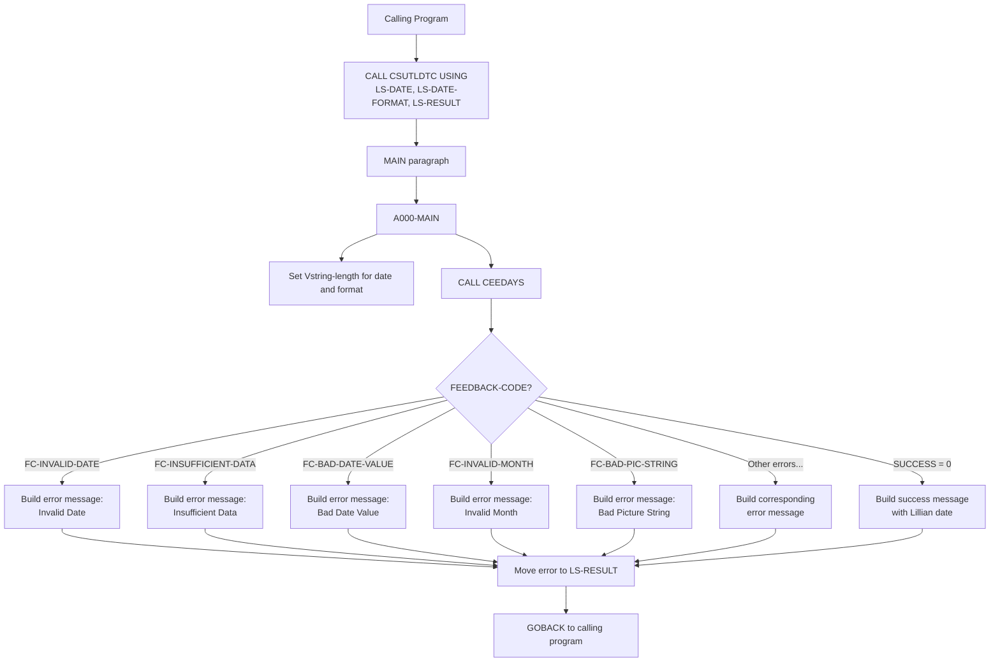

# Business Rules: CSUTLDTC

**Source program:** [app/cbl/CSUTLDTC.cbl](app/cbl/CSUTLDTC.cbl)  
**Program type:** UTILITY  
**Complexity:** LOW  
**Rules extracted:** 3  
**Extracted at:** 2026-03-06T00:00:00Z  

---

## Program Function

Date Validation Utility - Reusable called subprogram that validates date strings against specified format masks using IBM Language Environment CEEDAYS service. Returns validation result and Lillian date format for valid dates.

## Rules Summary

| Rule ID | Name | Type | Confidence | Paragraph |
|---------|------|------|------------|-----------|
| CSUTLDTC.INVALID-DATE-CHECK | Detect Invalid Date Format | VALIDATION | HIGH | A000-MAIN |
| CSUTLDTC.DATE-MASK-APPLICATION | Apply Date Format Mask for Validation | CALCULATION | HIGH | A000-MAIN |
| CSUTLDTC.LILLIAN-CONVERSION | Convert Valid Date to Lillian Format | CALCULATION | HIGH | A000-MAIN |

---

## Rule Details

### CSUTLDTC.INVALID-DATE-CHECK — Detect Invalid Date Format
**Type:** VALIDATION | **Confidence:** HIGH  
**Implemented in paragraph:** [A000-MAIN](app/cbl/CSUTLDTC.cbl#L114-L163)  
**Governs fields:** `FEEDBACK-CODE`, `FEEDBACK-TOKEN-VALUE`, 9 error condition names

**Description:** Uses CEEDAYS Language Environment service to validate date against specified format; detects 9 different error conditions including FC-INVALID-DATE, FC-BAD-DATE-VALUE, FC-INVALID-MONTH.

**COBOL snippet:**
```cobol
88 FC-INVALID-DATE         VALUE X'0000000000000000'
88 FC-INSUFFICIENT-DATA    VALUE X'000309CB59C3C5C5'
88 FC-BAD-DATE-VALUE       VALUE X'000309CC59C3C5C5'
88 FC-INVALID-ERA          VALUE X'000309CD59C3C5C5'
88 FC-UNSUPP-RANGE         VALUE X'000309D159C3C5C5'
88 FC-INVALID-MONTH        VALUE X'000309D559C3C5C5'
88 FC-BAD-PIC-STRING       VALUE X'000309D659C3C5C5'
88 FC-NON-NUMERIC-DATA     VALUE X'000309D859C3C5C5'
88 FC-YEAR-IN-ERA-ZERO     VALUE X'000309D959C3C5C5'
```

**Business context:** Centralizes date validation logic for reuse across CardDemo application; prevents invalid dates from entering financial records (e.g., February 31, month 13).

---

### CSUTLDTC.DATE-MASK-APPLICATION — Apply Date Format Mask for Validation
**Type:** CALCULATION | **Confidence:** HIGH  
**Implemented in paragraph:** [A000-MAIN](app/cbl/CSUTLDTC.cbl#L114-L163)  
**Governs fields:** `WS-DATE-TO-TEST`, `WS-DATE-FORMAT`, `Vstring-length`, `Vstring-text`

**Description:** Accepts date string and format mask as linkage parameters, applies mask to validate date structure using IBM CEEDAYS callable service.

**COBOL snippet:**
```cobol
CALL 'CEEDAYS' USING WS-DATE-TO-TEST
                     WS-DATE-FORMAT
                     OUTPUT-LILLIAN
                     FEEDBACK-CODE
```

**Input parameters:**
- `LS-DATE` (linkage): Date string to validate (e.g., "2026-03-06")
- `LS-DATE-FORMAT` (linkage): Format mask (e.g., "YYYY-MM-DD", "MM/DD/YYYY")

**Output parameter:**
- `LS-RESULT` (linkage): Validation result message with severity code, error number, and formatted details

**Business context:** Supports flexible date formats across international regions; validates dates from user input, file imports, and external interfaces.

---

### CSUTLDTC.LILLIAN-CONVERSION — Convert Valid Date to Lillian Format
**Type:** CALCULATION | **Confidence:** HIGH  
**Implemented in paragraph:** [A000-MAIN](app/cbl/CSUTLDTC.cbl#L114-L163)  
**Governs fields:** `OUTPUT-LILLIAN` (S9(9) BINARY)

**Description:** For successfully validated dates, converts to Lillian date format (integer day count) for date arithmetic and storage.

**COBOL snippet:**
```cobol
01 OUTPUT-LILLIAN PIC S9(9) USAGE BINARY
```

**Business context:** Lillian format enables efficient date arithmetic (e.g., days between dates, aging calculations) and compact storage. Lillian day 1 = October 15, 1582 (Gregorian calendar adoption).

**Use cases:**
- Calculate account age: `CURRENT-LILLIAN - ACCOUNT-OPEN-LILLIAN`
- Determine overdue status: `CURRENT-LILLIAN - DUE-DATE-LILLIAN > 30`
- Generate aging buckets: "0-30 days", "31-60 days", etc.

---

## Execution Flow



---

## Usage Example

### COBOL Calling Pattern
```cobol
WORKING-STORAGE SECTION.
01  WS-INPUT-DATE       PIC X(10) VALUE '2026-03-06'.
01  WS-DATE-FORMAT-MASK PIC X(10) VALUE 'YYYY-MM-DD'.
01  WS-VALIDATION-RESULT PIC X(80).

PROCEDURE DIVISION.
    CALL 'CSUTLDTC' USING WS-INPUT-DATE
                          WS-DATE-FORMAT-MASK
                          WS-VALIDATION-RESULT.
    
    IF WS-VALIDATION-RESULT(1:4) = '0000'
        DISPLAY 'Date is valid: ' WS-VALIDATION-RESULT
    ELSE
        DISPLAY 'Date is invalid: ' WS-VALIDATION-RESULT
        PERFORM ERROR-HANDLING
    END-IF.
```

### Java Migration Equivalent
```java
@Service
public class DateValidationService {
    
    public ValidationResult validateDate(String dateStr, String formatMask) {
        try {
            DateTimeFormatter formatter = DateTimeFormatter.ofPattern(
                convertCobolMask(formatMask)
            );
            LocalDate date = LocalDate.parse(dateStr, formatter);
            
            // Convert to Lillian format (days since Oct 15, 1582)
            long lillianDays = ChronoUnit.DAYS.between(
                LocalDate.of(1582, 10, 15), 
                date
            );
            
            return ValidationResult.success(lillianDays);
            
        } catch (DateTimeParseException e) {
            return ValidationResult.error(
                ErrorCode.INVALID_DATE_FORMAT, 
                e.getMessage()
            );
        }
    }
    
    private String convertCobolMask(String cobolMask) {
        return cobolMask
            .replace("YYYY", "yyyy")
            .replace("MM", "MM")
            .replace("DD", "dd");
    }
}
```

---

## Error Codes Reference

| Feedback Code | Condition Name | Meaning | Example |
|---------------|----------------|---------|---------|
| `X'000309CB59C3C5C5'` | FC-INSUFFICIENT-DATA | Date string too short for format | "2026-03" with mask "YYYY-MM-DD" |
| `X'000309CC59C3C5C5'` | FC-BAD-DATE-VALUE | Invalid day/month combination | "2026-02-31" |
| `X'000309CD59C3C5C5'` | FC-INVALID-ERA | Era value out of range | Historical date before 1582 |
| `X'000309D159C3C5C5'` | FC-UNSUPP-RANGE | Date outside supported range | Year 9999+ |
| `X'000309D559C3C5C5'` | FC-INVALID-MONTH | Month < 1 or > 12 | "2026-13-01" |
| `X'000309D659C3C5C5'` | FC-BAD-PIC-STRING | Format mask syntax error | "YYYY-XM-DD" |
| `X'000309D859C3C5C5'` | FC-NON-NUMERIC-DATA | Non-numeric chars in date | "202A-03-06" |
| `X'000309D959C3C5C5'` | FC-YEAR-IN-ERA-ZERO | Year zero in date | "0000-01-01" |

---

## Migration Notes

### Language Environment Dependency
- **CEEDAYS** is IBM LE (Language Environment) built-in function
- Modern alternatives: Java `java.time.LocalDate`, Python `datetime`, JavaScript `moment.js`
- Migration: Replace CALL CEEDAYS with `LocalDate.parse()` + custom validation

### Vstring Structure (Variable-Length String)
- COBOL Vstring uses length prefix (like Pascal strings)
- Modern equivalents: Java `String` (length implicit), C++ `std::string`
- No need to preserve Vstring structure in target language

### Lillian Date Format
- Keep Lillian conversion for date arithmetic if migrating incrementally
- Long-term: Replace with `LocalDate` or `java.time.temporal.ChronoUnit`

---

## Test Coverage Requirements

### Unit Tests
- Valid dates in various formats: "YYYY-MM-DD", "MM/DD/YYYY", "DD-MON-YYYY"
- Invalid dates: Feb 31, month 13, negative years
- Edge cases: Leap year validation (Feb 29 in 2024 vs 2023)
- Format mismatch: "2026-03-06" with mask "MM/DD/YYYY"
- Empty/null date strings

### Integration Tests
- Call from batch programs (CBACT01C, CBACT04C, etc.)
- Call from CICS programs (COSGN00C date of birth validation)
- Performance: 1 million date validations in < 10 seconds

---

## Related Programs

- **Called by:** CBACT01C, CBACT04C, CBIMPORT, COUSR01C, COUSR02C (any program validating dates)
- **Calls:** CEEDAYS (IBM Language Environment service)
- **Uses copybooks:** None (self-contained utility)

---

**Generated from Neo4j Knowledge Graph**  
**Query used:**
```cypher
MATCH (p:Program {program_id: 'CSUTLDTC'})-[:EMBEDS]->(br:BusinessRule)
OPTIONAL MATCH (para:Paragraph)-[:IMPLEMENTS]->(br)
RETURN br.rule_id, br.name, br.rule_type, br.confidence, para.name AS paragraph
ORDER BY br.rule_id
```
