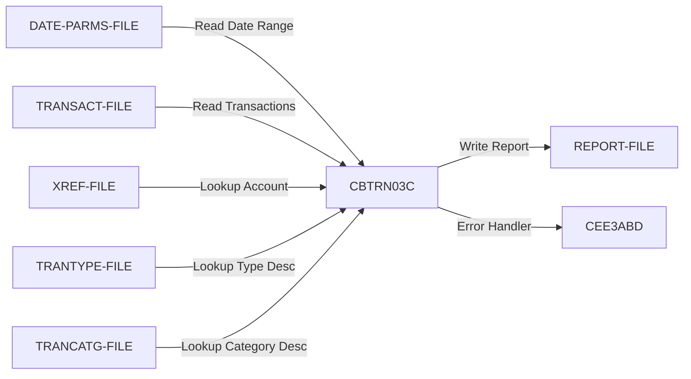

# CBTRN03C - Transaction Detail Report Generator

**Program ID:** CBTRN03C  
**Author:** AWS  
**Application:** CardDemo  
**Type:** BATCH COBOL Program  
**Complexity:** MEDIUM  
**Lines of Code:** 650  
**License:** Apache 2.0

---

## Executive Summary

CBTRN03C is a batch reporting program that reads transaction data, performs multi-file lookups, and produces a formatted transaction detail report with page totals, account totals, and grand totals. It processes transactions within a specified date range and enriches them with card cross-reference, transaction type, and category descriptions.

**Business Function:** Generate detailed transaction reports for CardDemo application with hierarchical totaling (page → account → grand total).

---

## Purpose

This program serves as the **primary transaction reporting engine** for the CardDemo batch processing suite. It:
- Reads transaction records from a sequential file
- Filters transactions by date range (start date to end date)
- Looks up card-to-account mappings via cross-reference file
- Enriches transactions with type descriptions and category descriptions
- Produces formatted reports with multi-level totaling
- Implements page breaks and header management
- Provides audit trail of all transactions processed

**Migration Priority:** MEDIUM - Core reporting functionality, but can be replaced with modern BI tools.

---

## Call Hierarchy

### Called By
- **No direct callers detected** (likely invoked by JCL batch job scheduler)
- Probable JCL: `CBTRN03.jcl` or similar batch report job

### Calls (External Programs)
- **CEE3ABD** - IBM Language Environment abend handler (error termination)

### VSAM/File Dependencies
This program does **NOT** call other COBOL programs but integrates with 6 data files.

---

## Data Dependencies

### Input Files

| File Name | Type | Organization | Access | Purpose |
|-----------|------|--------------|--------|---------|
| **TRANSACT-FILE** | Input | SEQUENTIAL | Sequential | Transaction records (TRANFILE) |
| **XREF-FILE** | Input | INDEXED (KSDS) | RANDOM | Card-to-account cross-reference (CARDXREF) |
| **TRANTYPE-FILE** | Input | INDEXED (KSDS) | RANDOM | Transaction type descriptions (TRANTYPE) |
| **TRANCATG-FILE** | Input | INDEXED (KSDS) | RANDOM | Transaction category descriptions (TRANCATG) |
| **DATE-PARMS-FILE** | Input | SEQUENTIAL | Sequential | Date range parameters (DATEPARM) |

### Output Files

| File Name | Type | Organization | Purpose |
|-----------|------|--------------|---------|
| **REPORT-FILE** | Output | SEQUENTIAL | Formatted transaction detail report (TRANREPT) |

### Copybooks Used

| Copybook | Purpose | Fields Defined |
|----------|---------|----------------|
| **CVTRA05Y** | Transaction record layout | Transaction data structure |
| **CVACT03Y** | Card cross-reference layout | Account-to-card mappings |
| **CVTRA03Y** | Transaction type layout | Type code and description |
| **CVTRA04Y** | Transaction category layout | Category code and description |
| **CVTRA07Y** | Transaction report layout | Report formatting structures |

---

## File I/O Flow



---

## Program Structure

### Main Processing Logic (PROCEDURE DIVISION)

```
START
├─ Open all 6 files (input: 5, output: 1)
├─ Read date range parameters
├─ MAIN LOOP (until end-of-file)
│  ├─ Read next transaction record
│  ├─ Filter by date range (WS-START-DATE to WS-END-DATE)
│  ├─ Detect account breaks (when card number changes)
│  │  └─ Write account totals
│  ├─ Lookup card cross-reference (card → account)
│  ├─ Lookup transaction type description
│  ├─ Lookup transaction category description
│  ├─ Write transaction detail line
│  ├─ Accumulate totals (page, account, grand)
│  └─ Handle page breaks (20 lines per page)
├─ Write final totals
├─ Close all files
└─ GOBACK
```

---

## Paragraphs (27 Total)

### Control Flow Paragraphs

| Paragraph Name | Lines | Type | Purpose |
|----------------|-------|------|---------|
| **PROCEDURE DIVISION** | 157-214 | MAIN | Main control loop and orchestration |
| **0550-DATEPARM-READ** | 221-245 | INPUT | Read date range parameters |
| **1000-TRANFILE-GET-NEXT** | 249-273 | INPUT | Read next transaction record |
| **1100-WRITE-TRANSACTION-REPORT** | 276-291 | OUTPUT | Write transaction detail with totaling logic |
| **1110-WRITE-PAGE-TOTALS** | 294-307 | OUTPUT | Write page-level totals and reset |
| **1120-WRITE-ACCOUNT-TOTALS** | 310-322 | OUTPUT | Write account-level totals and reset |
| **1110-WRITE-GRAND-TOTALS** | 325-329 | OUTPUT | Write final grand totals |
| **1120-WRITE-HEADERS** | 332-350 | OUTPUT | Write report headers and title |
| **1111-WRITE-REPORT-REC** | 353-371 | OUTPUT | Low-level file write with error handling |
| **1120-WRITE-DETAIL** | 373-390 | OUTPUT | Format and write transaction detail line |

### File Open/Close Paragraphs

| Paragraph Name | Lines | Purpose |
|----------------|-------|---------|
| **0000-TRANFILE-OPEN** | 393-409 | Open TRANSACT-FILE for input |
| **0100-REPTFILE-OPEN** | 412-428 | Open REPORT-FILE for output |
| **0200-CARDXREF-OPEN** | 431-448 | Open XREF-FILE for input |
| **0300-TRANTYPE-OPEN** | 451-467 | Open TRANTYPE-FILE for input |
| **0400-TRANCATG-OPEN** | 470-486 | Open TRANCATG-FILE for input |
| **0500-DATEPARM-OPEN** | 489-505 | Open DATE-PARMS-FILE for input |
| **9000-TRANFILE-CLOSE** | 545-562 | Close TRANSACT-FILE |
| **9100-REPTFILE-CLOSE** | 565-582 | Close REPORT-FILE |
| **9200-CARDXREF-CLOSE** | 585-601 | Close XREF-FILE |
| **9300-TRANTYPE-CLOSE** | 604-620 | Close TRANTYPE-FILE |
| **9400-TRANCATG-CLOSE** | 623-639 | Close TRANCATG-FILE |
| **9500-DATEPARM-CLOSE** | 642-658 | Close DATE-PARMS-FILE |

### Lookup/Reference Paragraphs

| Paragraph Name | Lines | Purpose |
|----------------|-------|---------|
| **1500-A-LOOKUP-XREF** | 508-517 | Read card cross-reference by card number |
| **1500-B-LOOKUP-TRANTYPE** | 520-529 | Read transaction type by type code |
| **1500-C-LOOKUP-TRANCATG** | 532-541 | Read transaction category by type+category code |

### Error Handling Paragraphs

| Paragraph Name | Lines | Purpose |
|----------------|-------|---------|
| **9999-ABEND-PROGRAM** | 663-667 | Abend program with return code 999 |
| **9910-DISPLAY-IO-STATUS** | 670-684 | Display formatted file status codes |

---

## Data Flow Analysis

### Accumulation Logic

The program implements **three-level totaling**:

1. **Page Totals (WS-PAGE-TOTAL)**
   - Accumulates every `TRAN-AMT` on each page
   - Resets after writing page total (every 20 lines)
   - Written when: page break detected (MOD 20 = 0)

2. **Account Totals (WS-ACCOUNT-TOTAL)**
   - Accumulates all transactions for a single card/account
   - Resets when card number changes (account break)
   - Written when: `WS-CURR-CARD-NUM NOT= TRAN-CARD-NUM`

3. **Grand Total (WS-GRAND-TOTAL)**
   - Accumulates all page totals
   - Never resets (final summary)
   - Written at: end of report

### Lookup Strategy

For each transaction, the program performs **3 VSAM lookups**:

```cobol
TRAN-CARD-NUM → XREF-FILE (RANDOM) → XREF-ACCT-ID
TRAN-TYPE-CD → TRANTYPE-FILE (RANDOM) → TRAN-TYPE-DESC  
TRAN-TYPE-CD + TRAN-CAT-CD → TRANCATG-FILE (RANDOM) → TRAN-CAT-TYPE-DESC
```

**Performance Consideration:** Each transaction triggers 3 random I/O operations. For 10,000 transactions, this results in 30,000 VSAM reads.

### Date Filtering

```cobol
IF TRAN-PROC-TS (1:10) >= WS-START-DATE
   AND TRAN-PROC-TS (1:10) <= WS-END-DATE
   CONTINUE  -- Process this transaction
ELSE
   NEXT SENTENCE  -- Skip this transaction
END-IF
```

---

## Risk Flags & Code Quality

### ✅ Good Practices
- ✅ **No GOTO statements** - Structured programming throughout
- ✅ **No ALTER statements** - No dynamic flow changes
- ✅ **Consistent error handling** - Every file operation has status check
- ✅ **Defensive programming** - INVALID KEY clauses on all VSAM reads
- ✅ **Modular design** - Clear separation of open/close/read/write logic
- ✅ **Proper cleanup** - All files closed in reverse order

### ⚠️ Moderate Concerns
- ⚠️ **Hardcoded page size** - `WS-PAGE-SIZE VALUE 20` (not parameterized)
- ⚠️ **Magic numbers** - APPL-RESULT values (0, 8, 12, 16, 23) not documented
- ⚠️ **Limited date validation** - Assumes date parameters are always valid
- ⚠️ **No record count limits** - Could produce very large reports

### 🔴 Migration Challenges
- 🔴 **Multiple VSAM dependencies** - 4 KSDS files require modernization
- 🔴 **Sequential input** - Entire file must be read (no pagination)
- 🔴 **Tight coupling to file layouts** - All 5 copybooks must migrate together
- 🔴 **Complex totaling logic** - State machine with 3 accumulator levels

---

## Variables of Interest

### Control Variables

```cobol
WS-FIRST-TIME        PIC X      VALUE 'Y'    -- First record flag
WS-LINE-COUNTER      PIC 9(09) COMP-3         -- Current line number
WS-PAGE-SIZE         PIC 9(03) COMP-3 VALUE 20 -- Lines per page
WS-CURR-CARD-NUM     PIC X(16)                -- Previous card for break detection
END-OF-FILE          PIC X(01)  VALUE 'N'     -- EOF indicator
```

### Accumulator Variables

```cobol
WS-PAGE-TOTAL        PIC S9(09)V99 VALUE 0    -- Page-level total
WS-ACCOUNT-TOTAL     PIC S9(09)V99 VALUE 0    -- Account-level total  
WS-GRAND-TOTAL       PIC S9(09)V99 VALUE 0    -- Report-level total
```

### Date Range Variables

```cobol
WS-START-DATE        PIC X(10)                -- Report start date (YYYY-MM-DD)
WS-END-DATE          PIC X(10)                -- Report end date (YYYY-MM-DD)
```

---

## Error Handling Strategy

### File Status Evaluation

```cobol
EVALUATE <FILE>-STATUS
  WHEN '00'   -- Success
     MOVE 0 TO APPL-RESULT
  WHEN '10'   -- End of file
     MOVE 16 TO APPL-RESULT  
  WHEN OTHER  -- Error
     MOVE 12 TO APPL-RESULT
END-EVALUATE
```

### Invalid Key Handling

All VSAM random reads include:
```cobol
READ <FILE> INTO <RECORD>
   INVALID KEY
      DISPLAY 'INVALID KEY: ' <KEY-VALUE>
      PERFORM 9999-ABEND-PROGRAM
END-READ
```

**Fail-Fast Philosophy:** Any data integrity error (missing key) immediately abends the job with return code 999.

---

## Migration Recommendations

### Complexity Assessment
**Estimated Migration Effort:** 8-10 days (1 developer)

| Factor | Rating | Justification |
|--------|--------|---------------|
| Code Structure | LOW | Well-structured, no GOTO/ALTER |
| Data Dependencies | HIGH | 5 input files, 4 VSAM KSDS |
| Business Logic | MEDIUM | Multi-level totaling, break logic |
| I/O Complexity | HIGH | 3 lookups per transaction |
| Report Formatting | MEDIUM | Fixed-width report layout |

### Modernization Strategy

#### Option 1: Lift-and-Shift (Low Risk, Low Value)
- Rewrite in Java/C# with same logic
- Replace VSAM with RDBMS (SQL joins)
- Keep sequential processing model
- **Effort:** 6-8 days

#### Option 2: Database-Centric (Medium Risk, High Value)
- Replace with SQL stored procedure
- Use single SELECT with JOINs:
  ```sql
  SELECT t.*, x.acct_id, tt.type_desc, tc.cat_desc
  FROM transactions t
  JOIN xref x ON t.card_num = x.card_num
  JOIN trantype tt ON t.type_cd = tt.type_cd
  JOIN trancatg tc ON t.type_cd = tc.type_cd AND t.cat_cd = tc.cat_cd
  WHERE t.proc_ts BETWEEN @start_date AND @end_date
  ORDER BY x.acct_id, t.proc_ts
  ```
- Use reporting tool (Crystal Reports, SSRS, PowerBI) for formatting
- **Effort:** 3-4 days

#### Option 3: Cloud-Native BI (High Risk, Highest Value)
- Migrate to AWS QuickSight / Tableau / Looker
- Create semantic layer over RDS/Aurora
- Enable self-service reporting (parameterized date ranges)
- Add filters: account, transaction type, amount range
- **Effort:** 8-10 days (includes BI setup)

### Recommended Approach
**Option 2 (Database-Centric)** provides best balance:
- ✅ Eliminates sequential file processing
- ✅ Leverages SQL optimizer (3 lookups → 1 JOIN query)
- ✅ Modern report writers handle totaling automatically
- ✅ Easier testing (compare SQL output to COBOL output)
- ✅ Lower ongoing maintenance

---

## Testing Considerations

### Unit Test Cases

1. **Empty Input File** - Verify graceful handling
2. **Date Range Filtering**
   - Transactions before start date (excluded)
   - Transactions after end date (excluded)
   - Transactions within range (included)
3. **Account Breaks**
   - Single account, multiple transactions
   - Multiple accounts, verify account total breaks
4. **Page Breaks**
   - Exactly 20 lines (page break edge case)
   - 21 lines (triggers page total)
5. **Invalid Keys**
   - Card number not in XREF-FILE
   - Transaction type not in TRANTYPE-FILE
   - Category not in TRANCATG-FILE
6. **Totaling Accuracy**
   - Verify WS-PAGE-TOTAL = sum of transactions on page
   - Verify WS-ACCOUNT-TOTAL = sum of all transactions for account
   - Verify WS-GRAND-TOTAL = sum of all WS-PAGE-TOTALs

### Integration Test Cases

1. **End-to-End Report Generation**
   - Known input file with 100 transactions
   - Verify output matches expected report format
2. **Large Volume Testing**
   - 10,000 transaction file
   - Verify performance and accuracy
3. **Multi-Account Testing**
   - 50 accounts with varying transaction counts
   - Verify account breaks and totals

---

## Performance Characteristics

### I/O Operations Per Transaction
- **1 sequential read** (TRANSACT-FILE)
- **3 random reads** (XREF, TRANTYPE, TRANCATG)
- **1 sequential write** (REPORT-FILE)

**Total I/O per transaction:** 5 operations

### Estimated Runtime
For 10,000 transactions:
- Sequential reads: 10,000 × 1ms = 10 seconds
- Random reads: 30,000 × 5ms = 150 seconds
- Sequential writes: 10,000 × 1ms = 10 seconds
- **Total:** ~3 minutes

### Bottleneck Analysis
🔴 **Primary Bottleneck:** 3 VSAM random reads per transaction

**Optimization Opportunity:**
- Pre-load TRANTYPE and TRANCATG into memory (typically small reference files)
- Reduces runtime from 3 min → 20 seconds (89% improvement)

---

## Dependencies Map

### Upstream Dependencies
- **JCL Job** (likely `CBTRN03.jcl`) - Batch scheduler invocation
- **TRANSACT-FILE** - Sequential transaction extract
- **DATE-PARMS-FILE** - Date range configuration

### Downstream Dependencies
- **Report Consumers** - Business users, finance department, auditors
- **Archive Systems** - Long-term storage of printed reports

### Critical Path
This program is likely part of **daily batch processing**:
```
Transaction Capture → TRANSACT-FILE → CBTRN03C → REPORT-FILE → Distribution
```

---

## Business Rules Implemented

1. **Date Range Filtering** - Only transactions within specified date range are reported
2. **Account Grouping** - Transactions grouped by card number (account)
3. **Page Break Logic** - New page every 20 detail lines
4. **Multi-Level Totaling** - Page → Account → Grand totals
5. **Reference Data Enrichment** - Every transaction includes type and category descriptions
6. **Data Integrity Enforcement** - Missing reference data causes job failure

---

## Documentation Metadata

**Generated By:** Documentation Generator Agent  
**Generated Date:** 2026-03-04  
**Knowledge Graph Source:** Neo4j  
**COBOL Source:** `aws-carddemo/app/cbl/CBTRN03C.cbl` (650 lines)  
**Analysis Tools:** MCP Neo4j Cypher queries + source code analysis

---

## Next Steps

1. **Review business requirements** - Confirm report consumers still need this format
2. **Analyze JCL** - Identify scheduler dependencies and runtime parameters
3. **Profile runtime** - Capture actual execution metrics in production
4. **Prototype SQL version** - Build query and compare output to COBOL report
5. **Stakeholder signoff** - Get approval for migration approach

**Priority:** MEDIUM - Core reporting function but can be replaced with modern BI tools

**Estimated Migration Timeline:** 2-3 weeks (analysis → development → testing → deployment)
